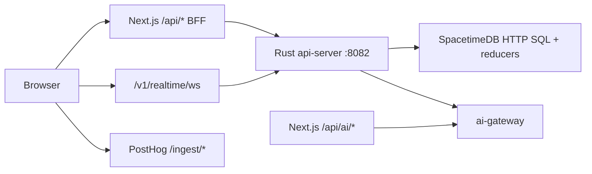

# Lumiere architecture

Canonical request flow for the Lumiere ERP web stack. For environment variables see [ENVIRONMENT.md](./ENVIRONMENT.md). For production deploy see [PRODUCTION_DEPLOY.md](./PRODUCTION_DEPLOY.md).

## Request flow



### Browser → ERP data

1. React app uses `@lumiere/api-client` (`apiFetch`) for `/api/query/*` and `/api/call/*`.
2. Next.js route handlers under [`frontend/web/app/api/`](../frontend/web/app/api/) forward most ERP paths to the Rust api-server via [`frontend/web/lib/api-server-forward.ts`](../frontend/web/lib/api-server-forward.ts) (`LUMIERE_API_SERVER_URL`).
3. api-server resolves the session (cookie `stdb_token` or `Authorization: Bearer`), scopes queries by organization, and calls SpacetimeDB HTTP SQL or reducers.
4. Optional direct gateway: set `NEXT_PUBLIC_API_GATEWAY_URL` to api-server origin (used by Kong in Docker compose) — see [`frontend/web/lib/api-url.ts`](../frontend/web/lib/api-url.ts).

### Realtime

- Browser WebSocket: same-origin `/v1/realtime/ws` (Kong) or `ws://127.0.0.1:8082/v1/realtime/ws` in local dev.
- api-server bridges SDK subscriptions to the client; see [`api-server/src/realtime/`](../api-server/src/realtime/).

### Query registry (Rust → TypeScript)

- **Source of truth:** [`crates/stdb-auth/assets/resource_registry.json`](../crates/stdb-auth/assets/resource_registry.json)
- **Codegen:** `make codegen` (`lumiere-codegen`) emits:
  - `frontend/packages/stdb/src/generated/query-registry.ts`
  - `stdb-generated-sql-columns.json` (frontend + `crates/stdb-auth/assets/`, from `generated/*_table.ts` + `types.ts`)
  - `erp-org-sql.json` (from `ERP_ORG_SQL` in `erp-subscriptions.ts` → Rust `erp_subscriptions.rs`)
  - `query-resource-row-type.json` copy (Rust asset → frontend)
  - `stdb-reducer-invalidation.ts` (from `lumiere-codegen/reducer-stdb-invalidation.json` → `useStdbCallMutation` manifest)
- **Query exec audit:** `query_exec_non_registry.json` allowlists virtual resources with custom SQL in `api-server/src/query_exec.rs` that are outside `resource_registry.json`; `make codegen` fails if arms drift from the allowlist.
- **CI:** `make check-codegen` fails if generated artifacts drift
- **Browser reads:** `GET /api/query/:resource` via api-server `query_exec.rs` (aligned with registry keys)
- **SSR reads:** All module RSC pages use `serverFetchQueryList` / `serverFetchQueryListsAllowEmpty` in [`frontend/web/lib/server-query.ts`](../frontend/web/lib/server-query.ts) → `GET /v1/query/:resource` on api-server
- **Admin SQL:** `@lumiere/stdb/server` exports `stdbSql` + entity types for Next.js auth/admin route handlers only

### AI

- Next.js `/api/ai/*` routes proxy to **ai-gateway** (RAG, action drafts, skills).
- ai-gateway reads tenant context from SpacetimeDB using service tokens; user session is validated at the Next BFF layer.

### Analytics

- PostHog browser SDK sends events to same-origin `/ingest/*` (rewritten in [`frontend/web/next.config.mjs`](../frontend/web/next.config.mjs)).
- Server events use [`frontend/web/lib/posthog-server.ts`](../frontend/web/lib/posthog-server.ts).

## Service ownership

| Service | Path | Owns |
|---------|------|------|
| **Next.js web** | `frontend/web/` | App shell, SSR, BFF forward, `/api/ai/*`, auth signup/signin forward |
| **api-server** | `api-server/` | Session, `/v1/query`, `/v1/call`, typed REST (CRM, sales, …), realtime WS |
| **SpacetimeDB module** | `spacetimedb/` | Tables, reducers, permissions, audit, domain logic |
| **ai-gateway** | `ai-gateway/` | LLM, RAG, embeddings, action draft orchestration |
| **Kong** | `infra/kong/` | Production path routing (`/api/query`, `/api/call`, web, ai-gateway) |

## Local development

```bash
# Terminal 1 — SpacetimeDB
spacetime start

# Terminal 2 — publish module
spacetime publish lumiere-v1-j1uo0 --module-path spacetimedb --server local -y

# Terminal 3 — api-server
LUMIERE_API_SERVER_URL= cargo run -p api-server   # or rely on Next forward default :8082

# Terminal 4 — Next.js
cd frontend/web && pnpm dev
```

Full browser smoke (includes seed + Playwright):

```bash
make e2e-smoke
```

## Staging / production

- Docker Compose + Kong front door — see [PRODUCTION_DEPLOY.md](./PRODUCTION_DEPLOY.md).
- `make check-env-prod` validates required secrets before deploy.
- Production api-server enforces `STDB_SERVER_TOKEN`, non-localhost `AI_GATEWAY_URL`, and (when enabled) reducer allowlist — see `LUMIERE_REDUCER_ALLOWLIST` in [ENVIRONMENT.md](./ENVIRONMENT.md).

## Gateway consolidation (complete)

Historical plans under `.cursor/plans/` tracked migrating the web stack off direct SpacetimeDB WebSocket + duplicated TS query layers. Status as of 2026-07:

| Track | Outcome |
|-------|---------|
| Registry + codegen (`lumiere-codegen`) | `resource_registry.json` → query-registry, SQL columns, erp-org-sql, reducer invalidation; `make check-codegen` in CI |
| SSR reads | All module `page.tsx` → `serverFetchQueryList` → api-server `query_exec.rs` |
| `@lumiere/stdb` surface | Main barrel: `DbConnection`, `erp-subscriptions`, `auth` only; domain hooks live in `@lumiere/query-hooks` |
| STDB WebSocket proxy | Removed `server.js`; `next dev` / `next start`; realtime via api-server `/v1/realtime/ws` + `useLumiereRealtime` |
| HTTP SQL `IN (...)` | `query_exec.rs` uses org scope or Rust-side filters; subscriptions use `col = id OR …`; see [company-id-in-sql-fix-plan.md](./company-id-in-sql-fix-plan.md) |
| Session security | No anonymous `STDB_SERVER_TOKEN` sessions; see [SECURITY.md](./SECURITY.md) |
| Call invalidation | `useStdbCallMutation` + generated `STDB_REDUCER_INVALIDATION` manifest |

## Deprecated docs

- [`frontend/web/PHASE0_IMPLEMENTATION.md`](../frontend/web/PHASE0_IMPLEMENTATION.md) — historical; referenced removed `server.js` STDB WebSocket proxy. Current stack uses api-server realtime bridge.

## Related

- [MVP workflow contract](./MVP_WORKFLOW_CONTRACT.md) — acceptance steps and E2E status
- [Reducer coverage matrix](./reducer-coverage-matrix.md) — backend ↔ UI wiring
