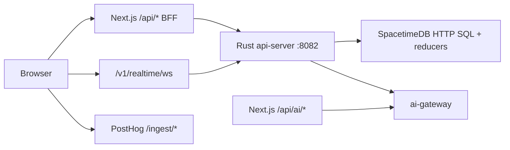

# Lumiere architecture

Canonical request flow for the Lumiere ERP web stack. For environment variables see [ENVIRONMENT.md](./ENVIRONMENT.md). For production deploy see [PRODUCTION_DEPLOY.md](./PRODUCTION_DEPLOY.md).

## Request flow



### Browser → ERP data

1. React app uses `@lumiere/api-client` (`apiFetch`) for `/api/query/*` and `/api/call/*`.
2. Next.js route handlers under [`frontend/web/app/api/`](../frontend/web/app/api/) forward most ERP paths to the Rust api-server via [`frontend/web/lib/api-server-forward.ts`](../frontend/web/lib/api-server-forward.ts) (`LUMIERE_API_SERVER_URL`).
3. api-server resolves the session (cookie `stdb_token` or `Authorization: Bearer`), scopes queries by organization, and calls SpacetimeDB HTTP SQL or reducers.
4. Optional direct gateway: set `NEXT_PUBLIC_API_GATEWAY_URL` to api-server origin (used by Kong in Docker compose) — see [`frontend/web/lib/api-url.ts`](../frontend/web/lib/api-url.ts).

### Realtime

- Browser WebSocket: same-origin `/v1/realtime/ws` (Kong) or `ws://127.0.0.1:8082/v1/realtime/ws` in local dev.
- api-server bridges SDK subscriptions to the client; see [`api-server/src/realtime/`](../api-server/src/realtime/).

### AI

- Next.js `/api/ai/*` routes proxy to **ai-gateway** (RAG, action drafts, skills).
- ai-gateway reads tenant context from SpacetimeDB using service tokens; user session is validated at the Next BFF layer.

### Analytics

- PostHog browser SDK sends events to same-origin `/ingest/*` (rewritten in [`frontend/web/next.config.mjs`](../frontend/web/next.config.mjs)).
- Server events use [`frontend/web/lib/posthog-server.ts`](../frontend/web/lib/posthog-server.ts).

## Service ownership

| Service | Path | Owns |
|---------|------|------|
| **Next.js web** | `frontend/web/` | App shell, SSR, BFF forward, `/api/ai/*`, auth signup/signin forward |
| **api-server** | `api-server/` | Session, `/v1/query`, `/v1/call`, typed REST (CRM, sales, …), OpenAPI, realtime WS |
| **SpacetimeDB module** | `spacetimedb/` | Tables, reducers, permissions, audit, domain logic |
| **ai-gateway** | `ai-gateway/` | LLM, RAG, embeddings, action draft orchestration |
| **Kong** | `infra/kong/` | Production path routing (`/api/query`, `/api/call`, web, ai-gateway) |

## Local development

```bash
# Terminal 1 — SpacetimeDB
spacetime start

# Terminal 2 — publish module
spacetime publish lumiere-v1-j1uo0 --module-path spacetimedb --server local -y

# Terminal 3 — api-server
LUMIERE_API_SERVER_URL= cargo run -p api-server   # or rely on Next forward default :8082

# Terminal 4 — Next.js
cd frontend/web && pnpm dev
```

Full browser smoke (includes seed + Playwright):

```bash
make e2e-smoke
```

## Staging / production

- Docker Compose + Kong front door — see [PRODUCTION_DEPLOY.md](./PRODUCTION_DEPLOY.md).
- `make check-env-prod` validates required secrets before deploy.
- Production api-server enforces `STDB_SERVER_TOKEN`, non-localhost `AI_GATEWAY_URL`, and (when enabled) reducer allowlist — see `LUMIERE_REDUCER_ALLOWLIST` in [ENVIRONMENT.md](./ENVIRONMENT.md).

## Deprecated docs

- [`frontend/web/PHASE0_IMPLEMENTATION.md`](../frontend/web/PHASE0_IMPLEMENTATION.md) — historical; referenced removed `server.js` STDB WebSocket proxy. Current stack uses api-server realtime bridge.

## Related

- [MVP workflow contract](./MVP_WORKFLOW_CONTRACT.md) — acceptance steps and E2E status
- [Reducer coverage matrix](./reducer-coverage-matrix.md) — backend ↔ UI wiring
