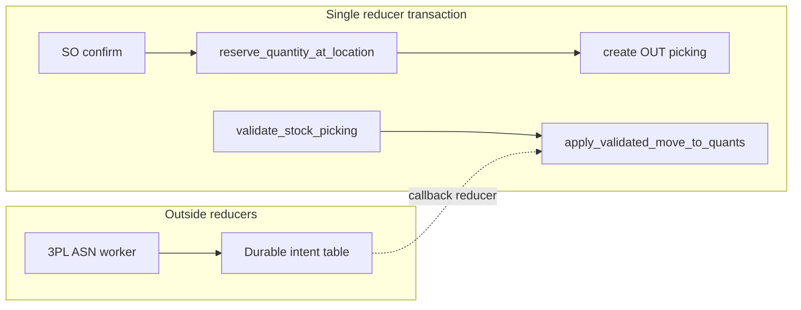

# Inventory & Warehouse Management Investigation

Current-state assessment of Lumiere inventory / WMS against a NetSuite *quality* bar (integrated ops/finance, multi-entity, drill-down, workflow controls, localization, extensibility, lifecycle, integrations) — not a feature-copy checklist.

**Investigation date:** 2026-07-16  
**Method:** Source-traced inventory. “Verified” means present in code. Domain/E2E test names are listed as *existence*; this document does not claim those suites were executed as part of this investigation unless noted under Validation.

**Verdict:** Lumiere has a usable **MVP stock spine** — product/warehouse/location masters, quants with reserved/available, stock moves/pickings whose validate posts quants, SO confirm soft ATP reservation (fail-closed), PO confirm → IN picking + `receive_po_line` → validate/backorder (quant increase), cycle-count post-to-quant, and landed-cost apply to quant value. Against the quality bar it is **strong** on reservation + picking validate + lead-to-cash/P2P stock consequences and (after 2026-07-16 pilot fixes) clean BFF contracts + live inventory WS coverage, **partial** on lots/serials/expiry/quality/UoM/costing, and **absent or schema-only / Unsuitable** for directed putaway, real wave planning, packing/cartonization, quarantine holds, cross-docking, 3PL, consignment ownership, safety-stock execution, replenishment that creates demand, and inventory-period close.

**Pilot-critical tranche (2026-07-16):** Phantom BFF keys removed; workspace keys wired into `ERP_ORG_SQL` (orphans `warehouse-3d` / `inventory-valuations` dropped); validate hot path uses `picking_key` + `move_by_picking`; company-isolation + ATP fail-closed domain tests added. See [`docs/plans/inventory-pilot-gap-fixes-plan.md`](./plans/inventory-pilot-gap-fixes-plan.md).

**V1 roadmap reconciliation:** [`docs/V1_ROADMAP.md`](./V1_ROADMAP.md) lists warehouses/locations, lot/serial, cycle count, and replenishment as “Shipped — Verify/polish.” Source truth (2026-07-16 follow-ups): **masters + cycle-count + ATP/validate Present**; **lot/serial enforce + FEFO/expiry + move serial_id Present**; **replenishment Partial** (execute creates draft PO/transfer). Competitive WMS (waves/QC quarantine/3PL/close) still Partial/Open.

**Purchasing investigation reconciliation:** PO receive→quant is **Present** for stocked products (`receive_po_line` → `validate_stock_picking_backorder`). Purchasing investigation matrix/narrative updated to match.

**Compile check:** `cargo check` in `spacetimedb/` — **passed** (2026-07-16, post pilot fixes).

---

## 1. Verified inventory

### 1.1 Tables (`spacetimedb/src/inventory` + adjacent)

| Area | Tables (accessor) | File | Notes |
|------|-------------------|------|-------|
| Product | `product`, `product_attribute`, `product_attribute_value`, `product_attribute_line`, `product_variant`, `product_supplier_info`, `product_packaging` | `product.rs` | Attribute tables: **no CRUD reducers** |
| Categories | `product_category` | `product_category.rs` | Soft-delete + restore |
| Warehouse | `warehouse`, `stock_location`, `stock_route`, `stock_rule`, `warehouse_3d_zone` | `warehouse.rs` | `crossdock` bool; QC loc FK; 3D zones are viewer metadata |
| Stock | `stock_quant`, `stock_move`, `stock_move_line`, `stock_picking` | `stock.rs` | Move lines seed-only; validate uses moves |
| Tracking | `stock_production_lot`, `stock_production_serial`, `serial_lot_traceability`, `stock_traceability_report` | `tracking.rs` | Expiry fields stored; not enforced on pick |
| Barcode | `barcode_rule`, `barcode_scan`, `barcode_nomenclature` | `barcode.rs` | |
| Quality | `quality_check`, `quality_alert`, `quality_alert_reason`, `quality_point`, `quality_team` | `quality.rs` | Fail does not move/hold quants |
| Adjustments | `stock_inventory`, `stock_inventory_line`, `inventory_adjustment`, `adjustment_reason` | `inventory_adjustments.rs` | `process_inventory_adjustment` state-only |
| Cycle count | `stock_cycle_count`, `stock_count_sheet` | `cycle_count.rs` | Post upserts quants |
| Replenishment | `replenishment_rule`, `stock_reorder_group` | `replenishment.rs` | Execute creates draft PO/transfer; reorder group unused |
| WMS ops | `warehouse_task`, `picking_wave`, `packaging_material`, `cartonization_result` | `warehouse_operations.rs` | Carton/material: **table only** |
| Valuation | `inventory_valuation` | `valuation.rs` | Mis-shaped (reorder-like fields); **no reducers / no inserts** |
| UoM (adjacent) | `uom_cat`, `uom`, `uom_conversion` | `core/reference.rs` | Create-only reducers |
| Landed cost (adjacent) | `stock_landed_cost`, `stock_landed_cost_lines` | `purchasing/landed_costs.rs` | Apply updates quant value |
| Consignment (adjacent) | `consignment_agreement` | `purchasing/procurement_advanced.rs` | No quant ownership rules |

### 1.2 Backend reducers (callable SpacetimeDB surface)

**Product (`product.rs`):**  
`create_product`, `update_product`, `update_product_pricing`, `update_product_inventory_data`, `delete_product`, `create_product_variant`, `update_product_variant`, `create_product_supplier_info`, `update_product_supplier_info`, `create_product_packaging`, `update_product_packaging`

**Categories (`product_category.rs`):**  
`create_product_category`, `update_product_category`, `delete_product_category`, `restore_product_category`

**Warehouse (`warehouse.rs`):**  
`create_warehouse`, `update_warehouse`, `delete_warehouse`, `create_stock_location`, `update_stock_location`, `delete_stock_location`, `create_stock_route`, `update_stock_route`, `delete_stock_route`, `create_stock_rule`, `update_stock_rule`, `delete_stock_rule`, `create_warehouse_3d_zone`, `update_warehouse_3d_zone`, `delete_warehouse_3d_zone`

**Stock (`stock.rs`):**  
`create_stock_quant`, `update_stock_quant_quantity`, `reserve_stock_quant`, `unreserve_stock_quant`, `move_stock_quant`, `create_stock_move`, `confirm_stock_move`, `assign_stock_move`, `done_stock_move`, `cancel_stock_move`, `create_stock_picking`, `confirm_stock_picking`, `assign_stock_picking`, `validate_stock_picking`, `validate_stock_picking_backorder`, `cancel_stock_picking`, `assign_user_to_picking`  

**Helpers (not reducers):** `resolve_warehouse_stock_location`, `product_requires_stock`, `reserve_quantity_at_location`, `unreserve_quantity_at_location`, `apply_validated_move_to_quants`

**Tracking (`tracking.rs`):**  
`create_stock_production_lot`, `update_stock_production_lot`, `delete_stock_production_lot`, `create_stock_production_serial`, `update_stock_production_serial`, `reserve_serial`, `use_serial`, `block_serial`, `delete_stock_production_serial`, `create_traceability_record`, `create_traceability_report`, `run_traceability_report`

**Barcode (`barcode.rs`):**  
`create_barcode_rule`, `update_barcode_rule`, `delete_barcode_rule`, `record_barcode_scan`, `process_pending_scans`, `create_barcode_nomenclature`, `update_barcode_nomenclature`, `add_rule_to_nomenclature`, `remove_rule_from_nomenclature`, `delete_barcode_nomenclature`

**Quality (`quality.rs`):**  
`create_quality_check`, `start_quality_check`, `pass_quality_check`, `fail_quality_check`, `create_quality_alert`, `open_quality_alert`, `assign_quality_alert`, `solve_quality_alert`, `cancel_quality_alert`, `create_quality_alert_reason`, `update_quality_alert_reason`, `delete_quality_alert_reason`, `create_quality_point`, `update_quality_point`, `delete_quality_point`, `create_quality_team`, `update_quality_team`, `add_member_to_quality_team`, `remove_member_from_quality_team`, `delete_quality_team`

**Adjustments (`inventory_adjustments.rs`):**  
`create_stock_inventory`, `create_inventory_adjustment`, `create_stock_inventory_line`, `create_adjustment_reason`, `update_stock_inventory_state`, `process_inventory_adjustment`

**Cycle count (`cycle_count.rs`):**  
`create_cycle_count_plan`, `start_cycle_count_session`, `record_cycle_count_line`, `validate_cycle_count`, `post_cycle_count_adjustments`

**Replenishment (`replenishment.rs`):**  
`create_replenishment_rule`, `execute_replenishment_rule` (draft buy PO via supplier info, else internal transfer)

**Warehouse ops (`warehouse_operations.rs`):**  
`create_picking_wave`, `create_warehouse_task`, `complete_picking_wave`, `update_warehouse_task_status`

**Valuation (`valuation.rs`):** *(none)*

**Adjacent:**  
UoM create trio (`core/reference.rs`); landed-cost lifecycle (`purchasing/landed_costs.rs`); sales SO confirm uses `reserve_quantity_at_location`; CSV imports in `data_ops/inventory_imports.rs`; `upsert_warehouse_geo` (fleet); IoT quality helpers (`link_device_to_quality_check`, `update_whatsapp_quality_score`).

### 1.3 Frontend contracts (BFF / hooks)

[`INVENTORY_BFF_REDUCERS`](../frontend/packages/stdb/src/commands/inventory-http.ts): **120** keys. Diff against SpacetimeDB reducers (post pilot fixes): **120 match**, **0 missing**.

Task start/complete/cancel map to `update_warehouse_task_status`; wave confirm/complete map to `complete_picking_wave`. Delete/update phantoms for waves, replenishment rules, quality check/alert, and UoM were removed from BFF and UI.

**Backend without BFF:** `process_pending_scans`.

Contract: [`inventory.contract.ts`](../frontend/packages/stdb/src/contract-tests/inventory.contract.ts) — compile-only; does **not** assert backend existence of BFF keys.

### 1.4 Subscriptions & queries

`INVENTORY_WORKSPACE_RESOURCE_KEYS` ([`inventory-workspace.ts`](../frontend/packages/stdb/src/subscriptions/inventory-workspace.ts)): **26** keys (dropped `warehouse-3d`, `inventory-valuations`; added `quality-alerts`).

| Key | In `ERP_ORG_SQL` | Notes |
|-----|------------------|-------|
| All current workspace keys | **Yes** | Live org-scoped WS builders present after pilot wire-up |
| `inventory-valuations` | Intentionally out of workspace | Unused/mis-shaped table; REST prefetch may still exist |
| `warehouse-3d` | Removed | Orphan key |

**Exception / ops queues:** No inventory Ops panel. No server-bounded keys (e.g. short ATP, expired lots, open waves, failed quality holds). Dashboard KPIs are client-derived from subscribed/REST data.

### 1.5 UI operations (`/inventory`)

Tabs from `inventoryModuleConfig` + injected tabs ([`inventory-client.tsx`](../frontend/web/app/(modules)/inventory/inventory-client.tsx)): Dashboard, Products, Categories, Stock on hand, Transfers, Stock moves, Warehouses, Adjustments, Locations (+ location tree), Lots/Serials, Quality checks (+ alerts), Cycle counts (+ wizard), Picking waves, Warehouse tasks, Routes/rules, Valuations, Replenishment, Barcode, Adjustment reasons, Traceability, 3D view.

| Tab | End-to-end operations | Gaps |
|-----|----------------------|------|
| Dashboard | KPIs; quick actions → product/transfer/adjustment | Charts/placeholders; no exception queues |
| Products | Create/update/delete; variant; pricing; inventory data; supplier/packaging; CSV; UOM create | No UOM update/delete reducers (UI no longer exposes) |
| Stock on hand | Create quant; reserve/unreserve; set qty; CSV | |
| Transfers | Create picking; confirm/assign/assign-user/validate/cancel | `validate_stock_picking_backorder` unused in UI |
| Cycle counts + wizard | Plan → session → line → validate → post | Domain tests thin on post |
| Waves / tasks | Create; complete wave; start/complete/cancel task via status | No delete/update wave; wave still non-orchestrating |
| Replenishment | Create; execute rule | Execute still timestamp-only (Unsuitable for ops demand) |
| Quality | Check lifecycle; alert lifecycle (wizard) | No update/delete check/alert |
| Valuations | List (REST) | Read-only; table unused on backend; not in live workspace |
| Lots / serials | CRUD; reserve/validate enforce lot/serial; FEFO + expiry block; move `serial_id` | UI for assign-serial still thin |

### 1.6 Tests (existence only)

| Layer | What exists | Not covered |
|-------|-------------|-------------|
| Domain | `run_all_inventory_tests`: receipt/delivery quant, isolation, ATP, lot/serial enforce, **expired lot block**, **FEFO**, **move serial_id validate**, **replenishment draft PO** | Cycle-count post, quality, waves/tasks, barcode, routes, UoM conversion, costing, quarantine/cross-dock/3PL, close |
| Sales (adjacent) | ATP shortfall / reserve-after-confirm / unreserve paths in sales domain tests | Multi-warehouse promise calendar |
| Playwright | `inventory-module.spec.ts` (@dev-fixture) shell/tabs; `inventory-mutations.spec.ts` (@p0) product update + category delete; lead-to-cash / returns paths exercise picking validate | Full transfer lifecycle, waves, cycle post, phantoms |
| Contract | `inventory.contract.ts` | Backend presence of BFF keys |

---

## 2. Gap matrix (quality bar vs inventory)

Definitions:

- **Present** — usable end to end with operational, inventory, and/or financial consequences.
- **Partial** — implemented at limited depth, or missing an essential UI, policy, reporting, or integration layer.
- **Absent** — no meaningful implementation.
- **Unsuitable** — surface exists but cannot safely meet the workflow requirement.

| Capability | State | Evidence |
|------------|-------|----------|
| Item masters | **Present** | Product CRUD + pricing/inventory data reducers + UI + CSV |
| Variants | **Partial** | Variant create/update; attribute/value/line tables without reducers; no attribute-driven generation |
| Units of measure | **Partial** | `uom` / conversion create; product `uom_id` / `uom_po_id`; **no** conversion on reserve/validate; no update/delete UoM reducers |
| Bins / locations | **Partial** | Hierarchical `stock_location` + warehouse FKs; `ZoneDisplayType::Bin` is 3D metadata, not directed bin putaway |
| Lots | **Present** (core) | Lot CRUD + `lot_id`; reserve/validate require lot; **FEFO** on soft reserve |
| Serials | **Present** (core) | Serial state machine; reserve/validate; move-level `serial_id` + FEFO among free/reserved |
| Expiry | **Present** (block) | Expired / past-removal lots & serials rejected on reserve/validate |
| Quality status | **Partial** | Checks/alerts/points/teams; fail stamps location hint only — **no** ATP hold or quant move |
| Transfers | **Present** | `move_stock_quant` + picking validate inbound/outbound quant apply |
| Reservations | **Present** | Soft reserve on quant; SO confirm uses `reserve_quantity_at_location`; fail-closed |
| Available-to-promise | **Present** (location-scoped soft ATP) | `reserved + qty > quantity` rejected; services skipped; not multi-WH / promise-date ATP |
| Safety stock | **Absent** | No dedicated field/reducer; variant min/max reorder unused for auto reorder |
| Replenishment | **Partial** | `execute_replenishment_rule` creates draft **PO** (supplier) or **internal transfer** when below min; still no scheduled scheduler worker |
| Cycle counting | **Present** | Plan → start → record → validate → `post_cycle_count_adjustments` upserts quants |
| Landed cost | **Present** (adjacent) | Allocate / post / apply to done-move dest quant `value`/`cost` |
| Costing methods | **Partial** | Product `cost_method` / `standard_price`; COGS helpers read quants (fifo/lifo/average/standard); stock ops default new quants to `"standard"` without layer maintenance |
| Directed putaway / picking | **Absent** | No putaway strategy reducers; tasks are free-string CRUD |
| Wave planning | **Unsuitable** | Wave stores `picking_ids`; create/complete flip state only — no pick orchestration |
| Packing | **Partial** | Pack location IDs on warehouse; product packaging CRUD; no pack-operation workflow |
| Cartonization | **Absent** | `packaging_material` / `cartonization_result` tables only — zero reducers |
| Consignment | **Absent** (inventory) | Purchasing agreement table; no vendor-owned quant rules |
| Quarantine | **Absent** | `wh_qc_stock_loc_id` field only; quality fail does not quarantine stock |
| Cross-docking | **Absent** | `warehouse.crossdock` stored; no flow |
| 3PL interfaces | **Absent** | No 3PL tables, intents, or adapters in inventory |
| Inventory-close reconciliation | **Absent** | No period-close reducer; `inventory_valuation` unused/mis-shaped; adjustment process does not post quants |
| PO receipt → stock | **Present** | `receive_po_line` → `validate_stock_picking_backorder` + receipt domain test |
| Live stock subscriptions | **Present** (org-scoped) | Workspace keys wired in `ERP_ORG_SQL`; no bounded exception queues yet |
| Phantom UI contracts | **Present** (cleared) | BFF ⊆ reducers after pilot fixes |
| Multi-entity / company isolation | **Partial** | Company fields + some guards; dedicated inventory isolation domain tests missing |
| Drill-down reporting | **Partial** | Traceability reports + move/picking links; no competitive valuation/close drill-down |
| Audit coverage | **Partial** | Many stock mutators use `write_audit_log_v2`; uneven across barcode/quality/wave paths |

---

## 3. Required invariants

### Accounting

| Invariant | Currently enforced | Evidence | Remaining requirement |
|-----------|-------------------|----------|------------------------|
| Quant quantity/value integrity on validate | Yes (txn) | `apply_validated_move_to_quants` in picking validate | Lot/serial/cost layer consistency |
| Soft ATP on SO confirm | Yes | `reserve_quantity_at_location` fail-closed | Multi-location allocation policy; serial ATP |
| Landed cost into inventory value | Partial | `apply_landed_costs` updates quant value | Period lock; bill/duty linkage |
| COGS costing methods | Partial | Journal helpers read quants by method | Maintain layers on receipt; inventory close |
| Inventory period close / recon | No | Absent | Close checklist; lock moves; valuation snapshot |
| Adjustment → stock | Partial | Cycle-count post mutates quants; `process_inventory_adjustment` does not | One documented post path for all adjustments |

### Authorization

| Invariant | Currently enforced | Evidence | Remaining requirement |
|-----------|-------------------|----------|------------------------|
| Reducer permissions | Yes (pattern) | `check_permission` on inventory resources | Audit every mutator; deny phantom BFF at API edge |
| Tenant / company ownership | Partial | Org + company on many creates; guards vary | Isolation tests company A vs B for quant/picking |
| Field-level controls | Partial | Subscription `fieldAccess` plumbing | Sensitive cost fields policy |

### Audit

| Invariant | Currently enforced | Evidence | Remaining requirement |
|-----------|-------------------|----------|------------------------|
| Append-only mutation log | Partial | Reserve/unreserve/picking/product paths often audited | Close gaps on wave/task/barcode/quality edges |
| Source-document links | Partial | Picking ↔ SO/PO origins; move ↔ picking | Quant → move → picking → order → invoice drill-down |
| Reason capture on adjustments | Partial | Adjustment reasons exist | Mandatory reason on cycle-count variance post |

### Concurrency / reservation

| Invariant | Currently enforced | Evidence | Remaining requirement |
|-----------|-------------------|----------|------------------------|
| Atomic reserve in one reducer txn | Yes | SpacetimeDB reducer atomicity + fail-closed ATP | Hot-item index (product+location+company); avoid full scans |
| Atomic picking validate → quant | Yes | Single validate reducer applies moves via `picking_key` / `move_by_picking` | Keep residual full-scan helpers (cycle/landed) off hot path |
| Residual reservation on backorder | Yes | Backorder path keeps residual reserved | UI exposure of backorder validate |
| Stale-state / double-validate | Partial | State preconditions on picking | Idempotent validate; explicit error on Done |
| No client multi-step stock commit | Intent | SO confirm reserves server-side | Never orchestrate reserve+validate across optimistic client steps without server guards |
| Hot-item contention proof | Partial | DB serializes reducers; ATP + company isolation domain tests added | Broader concurrent stress / latency measurement still open |
| Live exception queues | No | Client dashboard only | Bounded subscriptions: short ATP, expired lots, open QC fails |

SpacetimeDB atomicity model: each reducer runs in one transaction that commits or rolls back as a unit ([Transactions and Atomicity](https://spacetimedb.com/docs/2.0.0-rc1/databases/transactions-atomicity); [Functions](https://spacetimedb.com/docs/functions/)). External HTTP belongs in procedures/workers, not reducers.

---

## 4. Reference workflows

1. **Product master create → stockable → quant** — Present.
2. **Warehouse + location hierarchy** — Present (CRUD); directed bin putaway Absent.
3. **Internal transfer (picking validate)** — Present.
4. **SO confirm → ATP reserve → OUT picking → validate** — Present (sales + stock); e2e via lead-to-cash.
5. **PO confirm → IN picking → `receive_po_line` → quant up** — Present (reconciles older purchasing notes).
6. **Partial receive / backorder residual reservation** — Backend Present; UI underuses backorder validate.
7. **Cycle count plan → post adjustments** — Present reducers + wizard.
8. **Landed cost apply to quant value** — Present (purchasing UI/adjacency).
9. **Lot/serial tracked pick with FEFO** — **Implemented** (require lot/serial + FEFO + expiry block).
10. **Quality fail → quarantine hold** — **Not implemented**.
11. **Wave release → directed pick tasks** — **Unsuitable** (state CRUD / phantoms).
12. **Replenishment → PO/transfer demand** — **Unsuitable** (timestamp-only execute).
13. **Cartonization / pack** — **Absent**.
14. **Consignment / cross-dock / 3PL** — **Absent**.
15. **Inventory period close** — **Absent**.
16. **Cross-company isolation** — Org filters; dedicated tests **missing**.
17. **Live exception subscriptions** — Absent (client-derived KPIs).
18. **Remote / intermittent warehouse ops** — No offline queue; live WS only for core 7 keys.

### Acceptance scenarios (18)

1. Create stockable product with UoM and warehouse location; create quant; `available_quantity = quantity - reserved_quantity`; audit CREATE.
2. Two concurrent SO confirms for the same hot SKU at one location: second fails closed when ATP insufficient; first reservation persists; no negative available.
3. SO confirm creates OUT picking and reserves qty; validate delivery decreases source quant and releases reservation; residual unreserved when no backorder.
4. Partial delivery with backorder: residual stays reserved; backorder picking created; validate path consistent with `validate_stock_picking_backorder`.
5. PO confirm creates IN picking; `receive_po_line` validates and increases dest quant by received qty; PO `qty_received` matches.
6. Cycle count: plan → start → record variance → validate → post adjusts quant quantity/value; audit POST/UPDATE.
7. Landed cost: post/apply after receipt updates quant `value`/`cost` for allocated products.
8. Lot-tracked product: reserve/validate without `lot_id` rejected; FEFO + expired block — **passes**.
9. Serial-tracked product: free→reserved→in_use; move `serial_id` on validate — **passes**.
10. Quality fail (target): moves/holds qty in QC location and removes from ATP — **fails today**.
11. `execute_replenishment_rule`: draft PO (or internal transfer) when below min — **passes**.
12. Wave process/delete and warehouse-task start/complete/cancel/delete from UI return clear contract errors or are removed — **Unsuitable today** (phantom BFF).
13. Company B cannot reserve, validate, or adjust company A’s quants/pickings.
14. Multi-UoM: reserve/validate convert via `uom_conversion` — **fails today** (Partial).
15. Subscription clients see live short-ATP / expired-lot / open-QC queues without polling (target: server-bounded filters) — **fails today**.
16. Inventory close: freeze period, reconcile book vs quant, post valuation; subsequent validates blocked — **Absent**.
17. Remote warehouse with intermittent connectivity can queue scans and reconcile without double-post (target) — **Absent**.
18. Cross-dock / 3PL ASN inbound posts stock via durable intent/result (target) — **Absent**.

---

## 5. Localization matrix (inventory / warehouse–relevant)

Country packs today are **tax-seed + company-ID metadata** (`spacetimedb/src/core/country_pack.rs`). Inventory still needs operational overlays (units, remote sites, agri seasonality, import lead times, offline-tolerant scanning). Pack metadata flags such as `nfe_adapter` / `e_invoice` are **stubs**, not live integrations.

**i18n:** Inventory UI strings ship under English locale. Country packs are not language packs.

Rates and rules below are **dated requirements as of 2026-07-16**, cited from official sources where linked — **not legal advice**; verify before go-live.

| Concern | Oceania (AU / NZ) | Southern Africa (ZA only in-tree) | Brazil / Southern Cone (BR / AR / CL) | Maritime SEA (SG / MY / ID / PH / TH) |
|---------|-------------------|-----------------------------------|----------------------------------------|----------------------------------------|
| Pack keys | `au`, `nz` | `za` only | `br`, `ar`, `cl` | `sg`, `my`, `id`, `th`, `ph` |
| Units | Metric primary; retail dual-label common | Metric; some retail dual | Metric; agri bags/sacks local | Metric + local market units (catty/picul legacy in trade) |
| Remote warehouses | Mining / outback / island DC lag | Mining / regional DC | Interior agri / port split | Archipelago / multi-island DCs |
| Intermittent connectivity | Satellite / remote sites | Mine sites / rural | Rural agri coops | Island / barge links |
| Import lead times | Long sea legs from Asia/EU | Deep-sea + regional SADC | Mercosur / Asia long-haul | High import intensity; regional short-sea |
| Seasonal agriculture | Soft commodities / horticulture | Ag + mining inputs | Strong agri seasonality (BR/AR) | Palm, rice, seafood seasons |
| Traceability / lot | Food safety regimes (FSANZ / NZ MPI) | Food/ag compliance | MAPA / Senasa / SAG overlays | ASEAN food safety / Halal adjacency |
| Customs / bonded | ABF / NZ Customs | SARS Customs | Siscomex / ports | Free-trade zones / bonded |
| Inventory pack gap | Dual UoM + remote scan queue | Offline cycle count | Lot/FEFO for agri export | Multi-island transfer + 3PL ASN |

### Official sources (dated; verify)

| Region | Authority / reference |
|--------|----------------------|
| Australia biosecurity / food | [Department of Agriculture, Fisheries and Forestry](https://www.agriculture.gov.au); [FSANZ](https://www.foodstandards.gov.au) |
| New Zealand MPI | [Ministry for Primary Industries](https://www.mpi.govt.nz) |
| South Africa | [DALRRD](https://www.dalrrd.gov.za); [SARS Customs](https://www.sars.gov.za) |
| Brazil MAPA / Receita | [MAPA](https://www.gov.br/agricultura); [Receita Federal](https://www.gov.br/receitafederal) |
| Argentina Senasa | [Senasa](https://www.argentina.gob.ar/senasa) |
| Chile SAG / SII | [SAG](https://www.sag.gob.cl); [SII](https://www.sii.cl) |
| Singapore | [SFA](https://www.sfa.gov.sg); [Singapore Customs](https://www.customs.gov.sg) |
| Malaysia | [KPDN / MyInvois context](https://www.hasil.gov.my) |
| Indonesia | [BPOM](https://www.pom.go.id); [Bea Cukai](https://www.beacukai.go.id) |
| Thailand | [FDA Thailand](https://www.fda.moph.go.th) |
| Philippines | [FDA Philippines](https://www.fda.gov.ph); [BOC](https://customs.gov.ph) |

Neighboring Southern African markets (e.g. Botswana, Namibia, Mozambique) have **no** in-tree packs.

---

## 6. SpacetimeDB architecture decision (Inventory / WMS)

Quality benchmark for integrated inventory and warehouse operations: Oracle NetSuite inventory / warehouse management patterns ([NetSuite documentation](https://docs.oracle.com/en/cloud/saas/netsuite/ns-online-help/)). Architecture constraints from SpacetimeDB: reducers are automatically transactional; procedures are the HTTP boundary ([SpacetimeDB Functions](https://spacetimedb.com/docs/functions/); [Transactions and Atomicity](https://spacetimedb.com/docs/2.0.0-rc1/databases/transactions-atomicity); [Subscription semantics](https://spacetimedb.com/docs/subscriptions/semantics)).

| Topic | Decision |
|-------|----------|
| **Atomic mutations** | Keep ATP reserve, picking validate (quant apply), PO receive→validate, and cycle-count post in **single reducers** (or one internal `*_impl`) wherever atomicity is required. Do not leave stock sync to a client second step. |
| **Reservation correctness** | Soft reserve on `stock_quant` remains the pilot model: fail-closed when `reserved + qty > quantity`. Serial/lot reservation must join the same transaction as quant ATP before claiming tracked-product correctness. |
| **Hot-item contention** | Rely on SpacetimeDB txn serialization; picking validate uses denormalized `picking_key` + `move_by_picking` (Option indexes are not FilterableValue in STDB 2.0.1). Prefer composite indexes (product + location + company); avoid full-table `stock_quant().iter()` on cycle/landed hot paths. Domain ATP + company isolation tests landed. |
| **Subscriptions / scale** | Prefer **company-filtered** and **bounded exception** subscriptions (short ATP, expired lots, open QC fails, open waves). Wire remaining inventory workspace keys into `ERP_ORG_SQL` or drop them from the workspace list. Do not fan out unused valuation/wave tables to every client. |
| **Indexes** | Keep/use `quant_by_product`, `quant_by_location`, `move_by_picking`, lot/serial indexes. Index names must remain unique module-wide. |
| **External I/O** | 3PL ASN/WMS, customs, label printers, and commodity feeds go behind **API workers / procedures** with durable intents/results. Reducers must not block on HTTP. Offline scan queues reconcile via idempotent intent keys. |
| **Phantom contracts** | Remove or gate the 20 BFF-only keys at the API edge; prefer real reducers (`update_stock_inventory_state`, `update_warehouse_task_status`, `execute_replenishment_rule`, `complete_picking_wave`). |
| **Replenishment** | Either implement demand creation (draft PO / internal transfer) inside `execute_replenishment_rule`, or stop exposing “execute” as operational replenishment. |
| **Valuation / close** | Replace or reshape unused `inventory_valuation`; add inventory-close reducer that snapshots and locks; align COGS layers with receipt. |
| **WMS depth** | Waves/tasks must orchestrate pickings (assign, release, complete) or remain clearly non-operational. Cartonization/putaway/3PL are greenfield behind procedures when needed. |

---

## 7. Priority classification (remaining gaps)

### Pilot-critical

| Gap | Priority status | Notes |
|-----|-----------------|-------|
| Remove/gate 20 phantom BFF keys | **Closed** | BFF 120/120; UI rewired/hidden |
| Wire inventory workspace keys into `ERP_ORG_SQL` (or shrink workspace) | **Closed** | 26 workspace keys live; orphans dropped |
| Hot-path validate/reserve scale (`picking_key` + `move_by_picking`) | **Closed in-tree** | Option index not filterable in STDB 2.0.1; denormalized `picking_key` |
| Reservation contention + company isolation domain tests | **Closed in-tree** | `run_inventory_company_isolation_test` + `run_inventory_atp_fail_closed_test` |
| Lot/serial enforcement policy for tracked products | **Closed** | Reserve/validate + FEFO + expiry + move `serial_id` |
| Reconcile purchasing docs with receive→quant truth | **Closed** | Purchasing investigation matrix updated |
| Inventory e2e + `run_all_inventory_tests` green after publish | **Verify** | Expand beyond product shell mutations |

### Competitive

| Gap | Priority status | Notes |
|-----|-----------------|-------|
| FEFO / expiry block on pick | **Closed** | Soft-reserve FEFO; expired/removal blocked |
| Quality fail → quarantine + ATP hold | **Open** | QC location must have stock consequence |
| Replenishment that creates PO/transfer | **Closed** | Draft buy PO or internal transfer on execute |
| Directed putaway / pick task orchestration | **Open** | Couple `warehouse_task` to picking validate |
| Real wave release / assign | **Open** | Or demote UI to non-operational |
| Packing workflow | **Open** | Beyond pack location FKs |
| UoM conversion on reserve/validate | **Open** | Mixed metric/local units |
| Inventory period close + valuation snapshot | **Open** | Financial close adjacency |
| Exception queues (short ATP, expired lots, QC) | **Open** | Server-bounded SQL + Ops panel |
| Costing layer maintenance on receipt | **Open** | Align with COGS methods |

### Differentiating

| Gap | Priority status | Notes |
|-----|-----------------|-------|
| Cartonization engine | **Open** | Tables exist; algorithms/procedures absent |
| Consignment ownership on quants | **Open** | Vendor-owned vs company-owned |
| Cross-dock flow | **Open** | Beyond warehouse flag |
| 3PL ASN / outbound interfaces | **Open** | Durable intents + workers |
| Offline / intermittent remote warehouse sync | **Open** | Oceania / island / mine sites |
| Attribute-driven variant generation | **Open** | Competitive PIM depth |
| Advanced multi-warehouse promise ATP | **Open** | Calendar / lead-time ATP |
| Integration observability for WMS/customs | **Open** | Intent/result pattern |

---

## Bottom line

Lumiere’s inventory spine is **reservation-and-validate strong, WMS-depth still partial**: soft ATP, picking validate, lot/serial enforce + FEFO/expiry, move `serial_id`, and replenishment demand (draft PO/transfer) are real and tested. Pilot fixes also cleared phantom BFF contracts, wired live inventory subscriptions, and indexed picking validate via `picking_key`. Quality quarantine, waves/tasks orchestration, UoM conversion, inventory close, 3PL, cartonization, consignment, and cross-dock remain Open/Absent.

### Related docs

- [Purchasing & Procurement investigation](./PURCHASING_PROCUREMENT_INVESTIGATION.md) — receipt path reconciliation; landed costs
- [Sales & Order Management investigation](./SALES_ORDER_MANAGEMENT_INVESTIGATION.md) — SO ATP / picking adjacency
- [Multi-entity platform inventory](./MULTI_ENTITY_PLATFORM_INVENTORY.md) — tenant, FX, country packs
- [V1 roadmap](./V1_ROADMAP.md) — inventory “shipped” claims reconciled in Verdict
- Investigation brief: [inventory-warehouse-investigation-plan.md](./plans/inventory-warehouse-investigation-plan.md)
- Pilot fixes checklist: [inventory-pilot-gap-fixes-plan.md](./plans/inventory-pilot-gap-fixes-plan.md)
- Inventory module: `spacetimedb/src/inventory/`
- Inventory workspace: `frontend/packages/stdb/src/subscriptions/inventory-workspace.ts`
- BFF: `frontend/packages/stdb/src/commands/inventory-http.ts`
- Domain tests: `spacetimedb/tests/inventory/`
- E2E: `frontend/web/tests/e2e/inventory-module.spec.ts`, `inventory-mutations.spec.ts`
