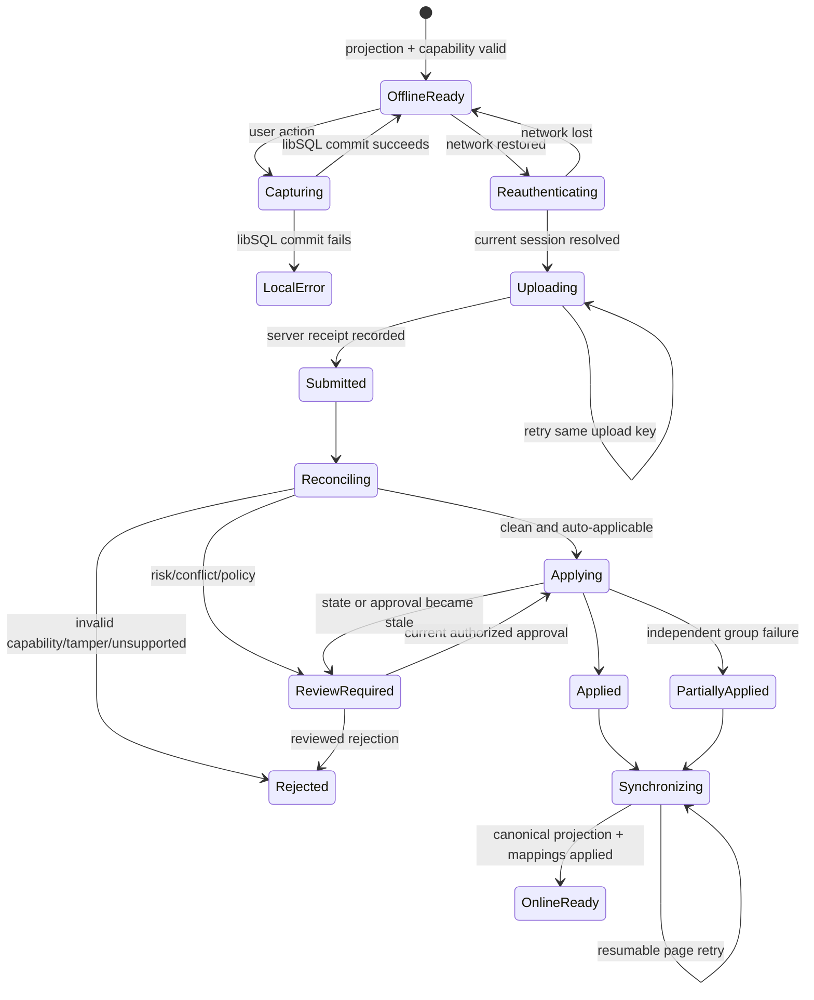

# Offline-first desktop synchronization through Lumiere ChangeSets

**Status:** Proposed — architecture plan only
**Tracks:** `offline-first`, `desktop`, `changesets`, `production-readiness`
**Related:** [sliding-window-cold-tier.md](./sliding-window-cold-tier.md) · [audit-log-cold-by-default.md](./audit-log-cold-by-default.md) · [backup-recovery-followup.md](./backup-recovery-followup.md) · [ARCHITECTURE.md](../ARCHITECTURE.md)

> The Postgres cold tier, shared `ResourceReadPlan`, stable Lumiere schema IR, and libSQL client projection described here are not implemented. This document extends PR #3's architectural direction; it does not claim those components exist today.

---

## 1. Decision

Build desktop offline support around a generic, server-reconciled **Lumiere ChangeSet** system.

A disconnected client stores an authorized local projection in an embedded **libSQL** database and captures immutable **reducer intents**. Reconnection uploads those intents for server-side authorization, reconciliation, conflict classification, approval, and execution through canonical SpacetimeDB reducers.

```text
offline user action
    ↓
libSQL transaction:
  local presentation effect + immutable ChangeSet action
    ↓
reconnect and refresh authority
    ↓
upload immutable actions idempotently
    ↓
api-server reconciliation and current-policy validation
    ├── clean, low-risk action → eligible for automatic application
    └── conflict or risk → review queue
                              ↓
                     authorized review
                              ↓
                  canonical STDB reducers
                              ↓
                 refreshed authorized projection
```

Offline is one ChangeSet producer. The same server-side model should later accept proposals from AI action drafts, imports, integrations, bulk operations, and automation without creating separate mutation architectures.

### 1.1 libSQL is the storage engine; Lumiere owns the sync protocol

This decision has two halves that must not be conflated.

| Layer | Choice | Rationale |
|---|---|---|
| **Client storage engine** | **libSQL** (§5.0): embedded SQLite fork, SQLite dialect and file format, Rust and JS bindings, encryption at rest, WAL | Closes the previously open "which SQLite distribution" question with a production-proven engine that inherits SQLite's durability lineage |
| **Synchronization protocol** | **Lumiere ChangeSet protocol, defined in §10** — *not* embedded replicas, engine sync, or offline writes for canonical business state | Engine replication moves *rows*; Lumiere must move *authorized reducer intents* reconciled against server policy. These are not substitutable. |

> **Non-negotiable:** libSQL is adopted as an embedded database, not as a synchronization strategy. The engine choice answers no question about multi-device editing, multi-user conflicts, or accounting correctness. Those are answered by §10 and §12, and would be answered identically on any SQLite-dialect engine.

Why engine-level replication cannot carry canonical ERP state:

1. **Default conflict resolution is row-level last-write-wins.** §10.4 forbids whole-row last-write-wins for ERP data. Two cashiers editing one order, or two clerks adjusting one stock quant, must not be resolved by push arrival order.
2. **Row replication bypasses reducers.** Replication pushes logical row mutations to a remote database. Lumiere's invariants (fiscal periods, stock ledgers, workflow transitions, approvals) live in SpacetimeDB reducers, not in table constraints. A row that arrives without executing its reducer is an unvalidated write.
3. **The remote would be the wrong authority.** A replication remote is another SQL database. Lumiere's authority is SpacetimeDB. Making a replication primary authoritative for business rows creates a second source of truth — the exact failure this architecture exists to prevent.
4. **Client-side mutation hooks are not authorization.** Pre-push transform hooks run on the device, under the user's control, with the user's stale permissions. Authorization must be re-resolved server-side at submission and merge (invariant 6).
5. **Permissions are per-row and per-field, not per-database.** Field-level policy (`resolve_read_columns`) and company scope cannot be expressed as replication of a whole database or table.

libSQL is therefore used strictly as a local engine: SQL execution, transactions, WAL, durability, encryption at rest, and file lifecycle. No hosted service is a runtime dependency, and no replication feature is enabled (§5.0).

### Key invariants

> A disconnected Lumiere client may continue capturing authorized business activity, but only canonical server reducers may make those actions part of authoritative ERP state. Offline storage records authorized local projections and user intent; reconnection performs server-side reconciliation, policy evaluation and, where necessary, human review before canonical mutation.

> Offline authority can never exceed the user's last server-authorized capability, and ChangeSet approval can never exceed the reviewer's current server-authorized capability.

Additional non-negotiable invariants:

1. SpacetimeDB remains authoritative for business state, reducer transactions, and business validation.
2. Postgres remains a generated cold projection only; it is not required for the first offline phase.
3. libSQL is durable local storage, not an independent ERP business engine, and not a synchronization authority. Embedded-replica, engine-sync, and offline-write paths are disabled for all canonical business tables.
4. Raw local table CRUD is never the canonical mutation representation. ChangeSet actions are reducer intents.
5. No reconnect path blindly replays queued mutations.
6. The api-server re-resolves identity, organization, company, permissions, field policy, reducer policy, versions, dependencies, and approvals before execution.
7. Sensitive fields not included in the server-authorized projection are never materialized locally. No engine-level replication may introduce a column or row that the server's field policy did not authorize.
8. React Query remains reactive query state; it is not the durable offline ledger.
9. Every upload and merge boundary is idempotent.
10. Physical events are reconciled as facts requiring acceptance, correction, compensation, or escalation—not presented as drafts that can simply be erased.

---

## 2. Goals and non-goals

### Goals

- Continue useful ERP workflows through multi-hour or multi-day WAN outages.
- Use libSQL from the first desktop release for durable, queryable, encrypted local state.
- Generate SQLite contracts from the same future Lumiere schema IR as Postgres and server metadata.
- Define an explicit Lumiere sync protocol (pull, push, conflict classification, permission re-resolution) that is independent of any engine-provided replication.
- Keep client schema evolution safe for devices that have been offline for weeks and are several application versions behind.
- Preserve one canonical reducer mutation path and existing authorization system.
- Provide explicit ChangeSet, conflict, dependency, review, and merge state machines.
- Minimize frontend churn by placing online/offline selection behind repository/API abstractions.
- Support selective synchronization rather than copying an entire tenant or historical archive.
- Provide a path from single-device offline operation to a future branch sync node without implementing distributed LAN synchronization now.
- Make the architecture reversible: local projections can be rebuilt from the canonical server without losing pending intents.

### Non-goals

- Implementing libSQL storage, desktop packaging, ChangeSet APIs, or Postgres in this PR.
- Running SpacetimeDB reducers locally.
- Reproducing server business validation in TypeScript or the client database.
- Making every resource and reducer offline-capable in the alpha.
- Supporting arbitrary multi-reducer atomic transactions before a domain reducer explicitly provides that transaction boundary.
- Peer-to-peer or multi-master synchronization.
- Universal last-write-wins conflict resolution.
- Using embedded replicas, engine-level sync, offline writes, or any replication feature as the transport for canonical business mutations.
- Depending on any hosted database service as a runtime dependency for business correctness, or storing authoritative tenant business state in a replication primary.
- Treating the React Query cache, browser `localStorage`, or opaque JSON snapshots as the durable offline database.

---

## 3. Responsibility boundaries

| Component | Authority and responsibility |
|---|---|
| SpacetimeDB | Canonical business state; reducer transactions; business invariants; canonical permission checks; authoritative ChangeSet/review records where they affect business decisions; audit rows; synchronization/version facts. |
| Postgres | Future generated historical projection only. The offline design must work before it exists and must not read PG directly from a desktop. |
| Rust api-server | Session resolution; organization/company scope; field permissions; future `ResourceReadPlan`; hot/cold merge; sync projection endpoints; capability issuance; ChangeSet upload; policy resolution; reconciliation; conflict detection; reviewer authorization; hydration; canonical reducer invocation; idempotent merge orchestration. |
| libSQL (embedded, on device) | Encrypted durable store for authorized projection rows, immutable local actions, ChangeSets, temporary IDs, dependencies, sync cursors, device state, capability grants, and attributable local approvals. Executes SQL and transactions. Holds no authority and performs no replication of its own. |
| React Query | Reactive view/query state over a repository. It may be seeded or invalidated from online API, realtime, or local database changes, but remains disposable. |
| Desktop wrapper | Secure key storage, libSQL driver, filesystem lifecycle, device identity, network-state integration, update/migration startup. It must remain behind runtime ports. |

libSQL may evaluate generated structural constraints needed to capture an intent safely—required fields, codec validity, dependency presence, and capability/policy availability. It must not independently decide credit, fiscal, inventory, workflow, tax, accounting, or approval business rules.

---

## 4. Current repository findings

The target architecture must begin from the repository as it exists, not from PR #3's proposed end state.

### 4.1 Current request and query seams

- [`docs/ARCHITECTURE.md`](../ARCHITECTURE.md) documents browser → Next BFF → Rust api-server → SpacetimeDB. It has no desktop/offline runtime today.
- `api-server/src/http_app.rs::post_call` resolves `ApiSession`, checks `reducer_allowlist::blocked_reducer_reason`, checks the first organization argument when present, and forwards directly to `StdbClient::call_reducer`.
- `api-server/src/query_exec.rs::execute_resource_query_for_company` is the current query seam. It resolves several resource-specific company scopes and contains many special cases before registry-backed SQL.
- There is no `ResourceReadPlan` type or STDB/PG dual-store compiler yet. PR #3 proposes it.
- There is no Postgres cold client, DDL, archive worker, or hot/cold merge implementation yet.
- `query_exec.rs::row_id_u64_strict` correctly rejects malformed business IDs, while `row_id_u64` still defaults to `0` for sorting. Generated offline codecs must never inherit a silent-zero conversion.

### 4.2 Current schema/codegen state

- `crates/stdb-auth/assets/resource_registry.json` is the canonical query-resource registry used by `stdb-auth`. Entries currently contain only `table`, `aliases`, `mandatory`, and `default_restricted`.
- `crates/stdb-auth/src/resource_registry.rs::ResourceEntry` mirrors that limited shape. Offline class, synchronization policy, reducer mapping, relations, ordering, and version metadata do not exist in the registry.
- `make generate-stdb-rust-sdk` already generates Rust client bindings into `api-server/src/stdb_sdk_bindings/` and then runs `scripts/fix-spacetimedb-rust-sdk-bindings.sh`.
- Generated Rust bindings expose concrete table and reducer types. For example, `account_move_type.rs::AccountMove` preserves `u64`, `Option<u64>`, `Timestamp`, `Identity`, and enum types; `approve_ai_action_draft_reducer.rs::ApproveAiActionDraftArgs` preserves typed reducer arguments.
- `lumiere-codegen/src/main.rs` does **not** consume those Rust bindings today. It emits frontend registry/invalidation assets and calls `sql_columns_emit::emit_sql_columns_json` using generated TypeScript.
- `lumiere-codegen/src/sql_columns_emit.rs` explicitly parses `frontend/packages/stdb/src/generated/*_table.ts` and `types.ts`. This is current behavior, but it conflicts with PR #3's target Rust-bindings → stable schema-IR chain and must not be extended for libSQL generation.
- `lumiere-codegen/reducer-stdb-invalidation.json` maps reducer names to affected query resources, but it does not describe reducer argument types, expected versions, offline eligibility, conflict fields, local presentation effects, idempotency, or approval policy.
- `make check-codegen` currently checks query registry, invalidation, SQL-column, ERP subscription, and allowlist artifacts. It does not regenerate Rust bindings or check schema IR, Postgres, libSQL, reducer manifests, or offline manifests.

### 4.3 Current authorization and session state

- `api-server/src/session.rs::resolve_api_session` resolves bearer/cookie authentication and organization membership.
- `session.rs::load_field_access_context` builds `stdb_auth::FieldAccessContext` from `user_profile`, `user_organization`, active roles, and field-permission rows.
- `FieldAccessContext` carries organization, role, role permissions, identity, superuser state, and `FieldPermissionLike` rules.
- `crates/stdb-auth/src/field_policy.rs::resolve_read_columns` combines registry mandatory fields with applicable read-field grants and default restricted fields. The future sync endpoint must reuse this resolution; it must not invent an offline field policy.
- Company scope is not represented by one generic plan today. `query_exec.rs` has resource-class-specific resolution such as `resolve_crm_company_id`, `resolve_inventory_company_id`, `resolve_purchasing_company_id`, and `resolve_accounting_company_id`.
- `api-server/src/realtime/mod.rs` revalidates session organization and company scope. Its WebSocket emits invalidation messages, not a durable sync log or offline row ledger.

### 4.4 Current frontend seams

- `frontend/packages/api-client/src/create-client.ts::LumiereApiClient` centralizes `apiFetch` and query-list parsing for cookie or bearer-token clients.
- `frontend/packages/api-client/src/stdb-gateway.ts` contains `queryStdbList`, `callStdbReducer`, and explicit safe-JSON handling for `bigint`; values above `Number.MAX_SAFE_INTEGER` are rejected because the current HTTP contract cannot represent them exactly.
- `frontend/packages/query-hooks/src/hooks/stdb.ts::useStdbQuery` fetches `/api/query/:resource`, scopes cache keys by organization/company, and uses React Query.
- `useStdbCallMutation` calls the BFF reducer endpoint and uses generated `STDB_REDUCER_INVALIDATION` metadata.
- `frontend/packages/query-hooks/src/hooks/realtime.ts::useLumiereRealtime` reconnects a WebSocket and invalidates React Query resources on server change messages.
- `frontend/packages/stdb/src/live/SubscriptionCacheBridge` and `cache-patch.ts` can seed React Query from the SpacetimeDB client subscription cache. That cache is live/disposable and is not suitable as the offline ledger.
- `frontend/packages/erp-session/src/context.tsx::ErpSessionProvider` exposes identity, connected state, organization, allowed companies, and active company. The active company alone is persisted in browser `localStorage` by `active-company-storage.ts`; this is not an offline security boundary.
- No Deno Desktop, Tauri, `libsql`, or `rusqlite` runtime/package is present in the repository. The database engine is decided (libSQL, §5.0); the desktop *wrapper* choice remains open and must stay behind the ports in §19.

### 4.5 Existing review and audit precedent

- `spacetimedb/src/ai/action_drafts.rs::AiActionDraft` stores a proposed reducer name, JSON parameters, proposer/reviewer identities, expiry, result, and status.
- `approve_ai_action_draft_core` rechecks expiry and reducer allowlisting, prevents self-approval for elevated drafts, executes a statically whitelisted operation, and audits the result.
- `action_draft_lifecycle.rs` starts/signals workflow instances with revision hashes, idempotency keys, correlation IDs, and notifications.
- This is useful precedent, not a generic ChangeSet engine: execution is a hand-written reducer dispatch, self-review is only blocked for elevated drafts, and one draft represents one proposed action.
- `spacetimedb/src/core/audit.rs::AuditLog` is append-only by convention and records old/new values, changed fields, actor, company, timestamp, and metadata. It is not a complete synchronization revision stream today.

### Consequence

Phase 0 must first establish the stable schema/reducer IR and server-side read/sync contracts. libSQL schema generation must not be bolted onto the current TypeScript parser, and ChangeSet reconciliation must not be placed in frontend hooks.

---

## 5. Generated libSQL client-database architecture

### 5.0 libSQL configuration and operational practice

**Engine: libSQL**, embedded in the desktop process, opened as a purely local database. SQLite dialect and file format, so every generated artifact below is ordinary SQLite and stays portable if the engine is ever swapped.

The engine is consumed through a deliberately thin surface: execute SQL, transactions, crash-safe durability, encryption at rest, WAL. Nothing else. That thinness is what keeps §19's adapter boundary credible and what makes the engine choice reversible.

**Required open configuration**, asserted at startup and in CI:

```text
open mode           local file only — never a replica or synced-database builder
encryption          EncryptionConfig { cipher: Aes256Cbc, key: <32 bytes from OS secure storage> }
journal_mode        WAL
synchronous         FULL          (ledger durability outweighs write throughput; see §21)
foreign_keys        ON            (local structural integrity only, never business validation)
busy_timeout        set explicitly — never rely on the default
temp_store          MEMORY, with encrypted-profile temp dir when spilling
```

**Practices that follow from libSQL being SQLite underneath:**

- **One writer.** Serialize writes through a single connection or an explicit write mutex; use a small read pool. SQLite's single-writer model is not a limitation here — the desktop has exactly one writer.
- **Explicit transactions around every ledger append**, wrapping the immutable action, dependencies, hash state, and local presentation effect together (§21).
- **Prepared statements** for all generated codecs; no string-built SQL in the repository layer.
- **`PRAGMA integrity_check`** at startup, before migration (§22.2).
- **Checkpoint deliberately.** WAL growth is a real disk-budget concern on POS hardware; checkpoint on a schedule and after large sync pages, and include WAL size in the §26 disk budget.
- **Never expose engine handles above the port.** React and domain code see `OfflineRepository` (§19), never a connection.

**Replication features are disabled, and startup must prove it:**

```text
embedded replica / synced-database open path   NOT USED
remote primary or sync URL                     NOT CONFIGURED
engine-level sync or offline-writes            DISABLED
```

> Startup must fail closed if any replication target is found configured on a database holding business tables. Such a path would both push unreconciled rows past the ChangeSet protocol and exfiltrate tenant rows outside the authorized projection. Treat it as a release blocker and cover it with the §22.2 integrity check.

**Portability is the real insurance.** Lumiere depends on an embedded library over a SQLite-compatible file, not on any hosted service, so vendor strategy has limited reach into this system. Keeping every generated artifact to plain SQLite dialect is the load-bearing decision: it preserves a fallback to another SQLite-dialect engine without touching domain code. Revisit the engine only on evidence — a needed capability available nowhere else, or a meaningful slowdown in libSQL's release and security-fix cadence.

### 5.0.1 Encryption at rest

The libSQL Rust surface offers a single cipher, `Cipher::Aes256Cbc`, with the key supplied as raw bytes. Two consequences must be stated plainly rather than assumed away:

| Property | Status |
|---|---|
| Confidentiality of the database file | Provided |
| **Tamper-evidence / integrity** | **Not provided.** AES-256-CBC is unauthenticated; there is no per-page MAC in this configuration. An attacker with file access can flip ciphertext bits and cause controlled plaintext corruption. |

Therefore the defence is layered, and the database cipher is deliberately *not* the primary control:

1. **OS full-disk encryption is the primary control** — FileVault, BitLocker, or LUKS, verified at device enrolment and reported in §26 telemetry. It is the layer that satisfies recognised compliance controls and, critically, the only layer covering what database encryption structurally cannot: WAL and journal files, temp files, OS swap where plaintext pages land, crash dumps, and the encrypted backups written in §22.2.
2. **libSQL `Aes256Cbc` with an OS-keychain key is the second layer**, defending the cases full-disk encryption misses: another OS user copying the file on a shared machine, or a device where full-disk encryption was never enabled. It does not carry the compliance claim alone.
3. **Integrity comes from the application, not the cipher.** §15's hash chain gives the ledger tamper-evidence independent of storage. Projection and sync-metadata tables are not tamper-evident — acceptable because they are disposable caches of server truth (§22.1), where corruption causes a rebuild rather than a false business fact. **Never claim tamper-proofing from the fact that the database is encrypted.**
4. **Prefer absence over encryption for sensitive data.** §16's `NeverLocal` is strictly stronger than field-level envelope encryption: a running app holds its own keys, so client-side field encryption buys little while costing queryability and codec complexity. Reserve it for a specific regulated field that must also be local — expected to be a very short list, possibly empty.

The strongest lever here is not cryptographic. It is selective sync (§16): every field that never reaches disk is one that never has to be defended, audited, or explained in an incident.

**Verification, enforced in CI** (extending the §25 sensitive-field test):

- assert the database file header is **not** `SQLite format 3`, proving encryption is genuinely active and not silently misconfigured;
- grep the raw database file *and the WAL* for known sensitive plaintext fixtures;
- assert no replication target is configured.

### 5.1 One source-of-truth chain

Extend PR #3's proposed chain rather than create a desktop-specific parser:

```text
SpacetimeDB Rust module definitions
        ↓
spacetime generate --lang rust
        ↓
api-server/src/stdb_sdk_bindings/
        ↓
lumiere-codegen Rust binding normalizer
        ↓
Lumiere schema + reducer IR
        ├── PG cold DDL/codecs/archive metadata       (future PR #3 work)
        ├── ResourceReadPlan/hydration metadata       (future PR #3 work)
        ├── reducer argument/effect metadata
        ├── offline policy manifest
        ├── libSQL projection DDL
        ├── libSQL migration graph
        ├── libSQL codecs
        └── TypeScript repository/query contracts
```

`lumiere-codegen` should gain explicit stages/modules, conceptually:

```text
rust_bindings_ir.rs     generated Rust bindings → stable IR
postgres_emit.rs        IR → PG artifacts
libsql_emit.rs          IR + offline manifest → libSQL DDL/migrations/codecs
reducer_manifest.rs     generated reducer args + reviewed annotations → reducer IR
offline_manifest.rs     registry + reducer IR + policy annotations → offline contract
```

Do not add libSQL output to `sql_columns_emit.rs`; that module currently recovers names from TypeScript and lacks sufficient type, key, enum, relation, and reducer information.

### 5.2 Projection table naming

Use one generated table per synchronized canonical table:

```text
projection_<sql_table>
```

Examples:

```text
projection_product_product
projection_res_partner
projection_pos_session
projection_stock_quant
```

Use SQL table names, not resource aliases, because multiple query resources may map to one table. A generated `local_resource_manifest` maps resource keys to projection tables, authorized columns, filters, indexes, and row codecs.

### 5.3 Separate row data from sync metadata

Do not add every possible sync field to every generated projection table.

Projection tables contain:

- generated authorized business columns needed by eligible local queries;
- the canonical primary key when the row has one;
- a generated `server_version` only when the table/reducer contract exposes a reliable per-record version;
- a generated `server_revision` indicating the projection revision that supplied the row.

Generic metadata belongs in separate tables:

```text
sync_resource_state(
  organization_id, company_id, resource_key,
  projection_schema_version, last_applied_revision,
  last_synced_at, sync_policy_hash, continuation_cursor
)

sync_row_state(
  resource_key, canonical_key,
  server_version, last_synced_revision, last_synced_at,
  local_state, tombstone_revision
)

temporary_id_map(
  local_id, resource_key, canonical_id, change_set_id, mapped_at
)

device_state(...)
offline_capability_grant(...)
```

`local_state` belongs in `sync_row_state`, not every business table. Suggested values are `clean`, `optimistic`, `pending_review`, `conflicted`, `dependency_blocked`, and `tombstoned`.

This metadata is Lumiere's own, written by Lumiere's protocol. It deliberately duplicates nothing from any engine-level replication bookkeeping, and must not be replaced by engine-managed sync state — the protocol in §10 has to remain inspectable, testable, and portable.

### 5.4 Explicit SQLite type mapping

The schema IR owns type mappings and generated codecs. These are plain SQLite-dialect mappings.

| Rust/STDB type | SQLite representation | Rule |
|---|---|---|
| `u64` / ID | fixed-width 20-digit decimal `TEXT` | Preserves full unsigned range and lexical numeric ordering when zero-padded. Generated codecs expose `bigint`; malformed or out-of-range values fail. Never coerce to zero. |
| signed integers | `INTEGER` when within SQLite signed 64-bit range | Checked codec. Wider future types require explicit text/blob mapping. |
| `Timestamp` | signed microseconds since Unix epoch in `INTEGER` | One precision and timezone convention across PG/SQLite/API codecs. |
| `Identity` | 32-byte `BLOB` | Exact bytes; display hex is a codec concern. |
| enum | canonical variant key in `TEXT` | Variants and display metadata live in the manifest. Avoid brittle table-level `CHECK` constraints that make additive enum migrations destructive. Unknown future variants block affected workflows until the app understands them. |
| `Option<T>` | `NULL` or mapped `T` | Preserve absence; do not use magic zero/empty values. |
| `bool` | `INTEGER` `0/1` with generated check | Codec rejects other values. |
| `f64` | `REAL` | Financial values should follow the canonical domain type; SQLite must not introduce new floating-point semantics. |
| `String` | `TEXT` | Preserve UTF-8. |
| JSON/structured string | canonical JSON `TEXT`, `json_valid` where supported | Canonicalization is generated; JSON remains a field representation, not the primary database model. |
| `Vec<T>` / custom struct | normalized child table when relation/query semantics require it; otherwise canonical typed JSON `TEXT` | The IR makes this decision once. |

Relations, foreign-key targets, cardinality, ownership, and dependency direction live in generated relation metadata. Foreign keys may protect local structural consistency, but they do not become business validation.

### 5.5 Generated indexes

Generate indexes only from actual local query and synchronization needs:

- canonical primary key;
- organization/company scope when present in the authorized projection;
- declared STDB indexes used by eligible local resource filters;
- deterministic sync ordering/cursor keys;
- relation foreign keys used by offline workflows;
- local-state/dependency indexes on metadata tables;
- ChangeSet status, source, submitted time, and action sequence.

Do not mirror every server index. `EXPLAIN QUERY PLAN` tests should justify additional desktop indexes and enforce a database-size budget.

### 5.6 Authorized materialization

libSQL stores the **resolved authorized API/sync projection**, not raw STDB rows and not a locally reconstructed STDB+PG merge.

The api-server must:

1. resolve current session, organization, company, role, and `FieldAccessContext`;
2. build the same future `ResourceReadPlan` used by normal reads;
3. intersect it with generated offline/sync policy;
4. return only authorized columns and rows;
5. attach projection/revision metadata outside the business payload.

On permission reduction, organization removal, logout, or policy-hash change, the client transactionally deletes no-longer-authorized rows/columns and invalidates dependent React Query state. Schema columns may exist in a generated table, but values that were not authorized must never be inserted.

---

## 6. ChangeSet domain model

### 6.1 ChangeSet

```rust
pub struct ChangeSet {
    pub id: ChangeSetId,
    pub source: ChangeSetSource,
    pub organization_id: u64,
    pub company_id: Option<u64>,
    pub actor_identity: Identity,
    pub device_id: DeviceId,
    pub capability_grant_id: CapabilityGrantId,
    pub base_sync_revision: SyncRevision,
    pub opened_at_local: LocalTimestamp,
    pub submitted_at_server: Option<Timestamp>,
    pub status: ChangeSetStatus,
    pub event_reality: EventReality,
    pub policy_version: PolicyVersion,
    pub root_hash: Hash,
}
```

Suggested sources: `OfflineDesktop`, `AiDraft`, `Import`, `Integration`, `BulkOperation`, `AutomationProposal`.

Suggested states:

```text
OpenLocal
  → SealedLocal
  → Uploading
  → Submitted
  → Reconciling
  → Clean | ReviewRequired | Conflicted | Rejected
  → Applying
  → Applied | PartiallyApplied | Failed | Compensating
  → Closed
```

Server state transitions are append-only events with a materialized current status. A sealed local ChangeSet cannot have actions edited or removed; corrections append new actions or create a successor ChangeSet.

### 6.2 Immutable reducer actions

```rust
pub struct ChangeSetAction {
    pub id: ActionId,
    pub change_set_id: ChangeSetId,
    pub sequence: u32,
    pub reducer: ReducerKey,
    pub reducer_schema_version: u32,
    pub args: CanonicalReducerArgs,
    pub occurred_at_local: LocalTimestamp,
    pub expected_versions: Vec<ExpectedRecordVersion>,
    pub dependencies: Vec<ActionId>,
    pub idempotency_key: IdempotencyKey,
    pub event_reality: EventReality,
    pub previous_hash: Hash,
    pub hash: Hash,
}
```

`args` are encoded with a generated reducer codec and persisted as canonical bytes plus a readable semantic rendering. JSON may be an API envelope, but untyped JSON is not the long-term reducer contract.

### 6.3 Reducer intents, not CRUD

An action says `create_sale_order`, `add_sale_order_line`, `confirm_sale_order`, or another canonical reducer—not “insert row into sale_order.” Reducers may touch multiple tables, create audit records, update revisions, and enforce invariants.

The server must not generate arbitrary SQL from an offline action. It invokes an offline-eligible canonical reducer or a generated typed dispatcher that calls the same canonical domain function inside a reducer transaction.

### 6.4 Atomicity limitation

The current generic api-server call path invokes one named reducer at a time. SpacetimeDB does not provide an api-server facility for dynamically grouping unrelated reducers into one transaction, and the existing AI draft dispatcher is hand-written.

Therefore:

- one reducer action is the default atomic unit;
- a workflow requiring all-or-nothing behavior must expose a purpose-built canonical batch/domain reducer;
- ChangeSets may be partially mergeable only when policy explicitly allows independent action groups;
- dependencies never run after a prerequisite fails unless a reviewed policy marks that edge optional;
- the UI must never label a multi-action ChangeSet “atomic” unless one canonical reducer provides that guarantee.

---

## 7. Git/GitHub-inspired semantics

| Git/GitHub concept | Lumiere meaning |
|---|---|
| branch | disconnected device/session work stream |
| commit | immutable reducer-intent action |
| pull request | ChangeSet submitted for reconciliation/review |
| base SHA | server synchronization revision at capture time |
| diff | generated semantic ERP effect, not a raw row diff alone |
| conflict | canonical state/policy changed incompatibly since the base |
| review | currently authorized organizational decision |
| merge | canonical reducer execution |
| rebase | server reconciliation against current state, producing a new plan; never silent action rewriting |

The analogy stops where physical reality begins.

```rust
pub enum EventReality {
    Proposal,
    DigitalOnly,
    PhysicalEvent,
}
```

- A draft quotation is a `Proposal`: `Approve` and `Reject` are meaningful.
- A description edit is `DigitalOnly`: reject/re-edit may be meaningful.
- A cash POS sale, goods receipt, delivery, or physical stock movement is a `PhysicalEvent`: review actions are `Accept`, `Reconcile`, `Correct`, `Compensate`, or `Escalate`.

The review UX must preserve the original event and append corrections/compensating actions. It must not imply that rejecting a recorded physical event makes it not have happened.

---

## 8. Hierarchical policy/rules engine

Resolve effective policy in this order:

```text
server safety floor
    ↓
organization policy
    ↓
resource-class policy
    ↓
resource/table policy
    ↓
reducer policy
    ↓
runtime conditions (amount, age, capability, device, conflict, outage duration)
    ↓
effective ChangeSet action policy
```

The most restrictive applicable rule wins. No frontend override may weaken it.

```rust
pub enum OfflineResourceClass {
    Reference,
    Collaborative,
    Transactional,
    Critical,
}

pub enum OfflineMode {
    Allowed,
    AllowedWithReview,
    LocalApprovalRequired,
    OnlineOnly,
}

pub enum ApprovalPolicy {
    None,
    OneAuthorizedReviewer,
    Supervisor,
    DualApproval,
}

pub enum ConflictPolicy {
    AutoMergeIndependentFields,
    RequireReviewIfChanged,
    AlwaysReview,
    CannotReconcileAutomatically,
}
```

### Generated from schema/reducer metadata

- reducer argument codec and schema version;
- affected resources/tables, extending the current invalidation manifest;
- primary keys, relation/dependency metadata, and version fields;
- fields read/written when statically known;
- local presentation-effect capability;
- whether temporary IDs are accepted;
- whether reducer/domain logic exposes idempotency;
- default resource class and synchronization eligibility;
- semantic diff renderer identifiers.

### Fixed server policy

- default deny for unknown reducers or manifest drift;
- organization/company and capability binding;
- no self-approval by default;
- current reviewer reauthorization;
- online-only hard floor for fiscal close, permission administration, destructive tenant operations, secrets, and unsupported critical reducers;
- tamper/hash verification;
- dependency and idempotency enforcement;
- maximum capability lifetime and clock-skew tolerance.

### Organization-configurable within the server floor

- offline enablement by location/device/group;
- amount/quantity thresholds;
- supervisor or dual-approval requirements;
- selective-sync windows and size quotas;
- lower-risk grace windows;
- whether local supervisor evidence satisfies the first approval stage;
- conflict escalation routes.

Policy is versioned and hashed. The capability grant identifies the exact effective policy authorized at the last sync. Changed policy is re-evaluated at submission and merge.

---

## 9. Authorization and approval model

Reuse `ApiSession`, `FieldAccessContext`, role permissions, field permissions, organization membership, and existing company-scope resolvers. Do not create an offline-only RBAC engine.

Separate action permission from review permission. Suggested role permissions:

```text
offline_changes:view
offline_changes:review
offline_changes:approve
offline_changes:approve_inventory
offline_changes:approve_financial
offline_changes:override_conflict
offline_changes:admin
```

These augment—not replace—the target reducer's normal resource/action permissions.

At capture time, the client verifies that the signed capability listed the reducer/mode/company and that the local user still has access to the unlocked profile. At submission and again immediately before merge, the api-server verifies:

1. current identity and active organization membership;
2. current company access;
3. current target reducer permission;
4. current field/write policy;
5. device and capability binding;
6. effective offline/review policy;
7. reviewer-specific approval permission;
8. separation of duties;
9. approval freshness against the latest reconciliation-plan hash.

Default to `reviewer != actor`. An organization may relax this only for explicitly low-risk digital actions within the fixed server floor. Critical/financial overrides require specific permissions, never a generic `admin` boolean alone.

An approval signs the exact reconciliation-plan hash. Any action edit, policy change, canonical version change, dependency result, or regenerated diff makes the approval stale.

---

## 10. The Lumiere synchronization protocol

### 10.1 Current gap

The repository has per-table IDs/timestamps and append-only audit rows, but no proven organization-wide synchronization revision that covers every canonical mutation. `audit_log.id` cannot be assumed complete enough to serve as a global base revision.

There is also no wire protocol. The storage engine does not supply one: as established in §1.1, engine-level replication moves rows with last-write-wins and bypasses reducers. This section defines the protocol Lumiere owns end to end.

### 10.2 Shape of the protocol

Two independent, separately versioned channels. They never share a transaction and may run at different cadences.

```text
PULL   server ──► device    authorized projection frames, server-ordered by revision
PUSH   device ──► server    immutable ChangeSets of reducer intents
```

Asymmetry is deliberate and is the property that makes ERP correctness achievable:

- **Pull carries rows.** They are already-authorized, already-validated server facts. The device applies them verbatim; it never merges them with local business logic.
- **Push carries intents, never rows.** The device may not state what a table *should contain*; it may only state what the user *asked to do*. The server decides what that means against current state and current policy.

A row-replication protocol collapses this asymmetry — which is why the engine's own sync cannot be used here.

```text
device                                   api-server                     SpacetimeDB
  │                                          │                               │
  │──(1) POST /sync/pull  cursor,policy_hash►│                               │
  │◄─────── frames + next_cursor ────────────│◄── authorized read plan ──────│
  │  apply frames + advance cursor           │                               │
  │        (one libSQL transaction)          │                               │
  │                                          │                               │
  │──(2) POST /sync/push  sealed ChangeSet ─►│                               │
  │◄─────── receipt (accepted, plan_hash) ───│                               │
  │                                          │─ reconcile: versions, policy  │
  │                                          │  ├─ clean  ──► reducer ──────►│
  │                                          │  └─ conflict ──► review queue │
  │──(3) POST /sync/outcomes  since=cursor ─►│                               │
  │◄─────── per-action outcomes + temp IDs ──│                               │
  │  apply outcomes, map temp IDs            │                               │
```

### 10.3 Revision model

Introduce a canonical monotonic `SyncRevision` per organization and, where isolation requires it, company. Revision advancement must be committed with the canonical mutation or emitted from a guaranteed SpacetimeDB transaction event mechanism. The design must prove there is no successful offline-eligible mutation without a corresponding revision/event.

Each sync event records:

```text
revision
organization_id
company_id
resource/table
canonical_key
operation
record_version
changed_field_set or semantic effect class
transaction identity where available
```

Retention is a protocol parameter, not an implementation detail: the server must keep the event stream long enough to serve the longest supported offline window (§22), and must be able to tell a device "your cursor is older than my retention — fall back to snapshot" rather than silently skipping revisions.

### 10.4 Pull

**Request:** `(scope, resource_key, cursor, policy_hash, protocol_version, schema_version)`.

**Server obligations, in order:**

1. re-resolve session, organization, company, roles, and `FieldAccessContext` — the cursor confers no authority;
2. build the `ResourceReadPlan` and intersect it with the offline/sync policy (§16);
3. compare the client's `policy_hash` with the currently resolved one;
4. emit frames, ordered by revision, each carrying only authorized columns;
5. return `next_cursor` and the authoritative `policy_hash`.

**Frame kinds:**

| Frame | Meaning | Client action |
|---|---|---|
| `upsert` | row is authorized and current at revision R | replace projection row, set `sync_row_state` |
| `delete` | row deleted canonically | tombstone |
| `revoke` | row or column is **no longer authorized** — distinct from deletion | delete local material, invalidate cache; never render as a business deletion |
| `resnapshot` | cursor unusable (retention lapse, policy change, schema change) | drop and rebuild the projection for that resource, preserving pending ChangeSets |
| `policy_change` | `policy_hash` moved | re-evaluate authorized set before applying further frames |

**Client obligations:** apply a page and advance `last_applied_revision` in **one libSQL transaction**. A partially applied page must be impossible (§21). Cursors advance only on full success.

**Ordering:** frames are applied in server revision order per resource. Cross-resource ordering is not guaranteed and the client must not infer referential completeness from it — this is why local foreign keys are structural only and why dependency state lives in `sync_row_state`.

### 10.5 Push

Push uploads sealed, immutable ChangeSets (§6). The device never pushes table rows.

**Stages:**

| Stage | Server action | Failure mode |
|---|---|---|
| receipt | verify device, capability, hash chain, protocol/action schema versions; record `(organization, device, changeset_id, root_hash)` | tamper (same ID, different hash) → reject and alert |
| authorize | re-resolve current identity, org, company, role, field policy, reducer policy | capability expired or permission reduced → reject or route to review; never execute on stale authority |
| reconcile | load canonical current versions for every row the action depends on; classify per §10.7 | version drift → conflict |
| plan | derive `plan_hash` from immutable actions + canonical versions + policy version | stale plan cannot merge |
| execute | invoke canonical reducers in dependency order, idempotency key enforced in the same STDB transaction (§17) | partial application reported per action, never as a whole-set failure |
| outcome | record per-action result, canonical IDs, temp-ID mappings | client fetches via stage (3) |

Push is **never** implicit. There is no path where a local write reaches the server as a side effect of the database being open — an important property that engine-level offline writes would remove.

### 10.6 Per-record expected versions

Every mutable offline-target record needs an explicit version or stable revision hash. The action records versions for all rows on which the intent materially depends — not only the row it appears to edit.

Generated schema IR identifies version fields and relations. Reducer/domain metadata identifies additional read dependencies and semantic conflict fields.

This is what makes conflict detection possible at all. Last-Push-Wins needs no versions precisely because it discards the information that would have revealed the conflict.

### 10.7 Conflict classification

Do not use whole-row last-write-wins.

- generated field sets can prove independent field changes;
- reducer metadata can mark commutative operations, set additions, counters, immutable events, and non-mergeable fields;
- the server may auto-reconcile `customer.phone` versus a concurrent `customer.email` update if policy allows;
- competing `credit_limit` changes are a true conflict;
- stock, accounting, workflow transitions, and approvals default to semantic review even when fields differ;
- unknown or incomplete dependency metadata defaults to review/deny, not auto-merge.

A "rebase" produces a new immutable reconciliation plan referencing original actions. It does not rewrite the uploaded ledger.

Worked contrast, two devices offline editing one sales order:

| | Engine row sync (Last-Push-Wins) | Lumiere protocol |
|---|---|---|
| Device A adds line, device B changes customer | later push overwrites the whole row; one edit vanishes silently | disjoint field sets; policy may auto-reconcile both |
| Both change `credit_limit` | later push wins, no record that a decision was made | true conflict → review queue with both values and actors |
| A confirms order, B cancels it | arrival order decides; stock and journal effects are whatever the last row said | semantic review; reducers decide legality; compensation if a physical effect already occurred |
| B's role lost order-confirm permission while offline | row still replicates — permission was never consulted | re-authorized at push; rejected with evidence preserved |

### 10.8 Permissions across the protocol

Authority is re-resolved at **four** independent boundaries. None may be skipped, and none may be inferred from another.

| Boundary | Resolved | Guarantee |
|---|---|---|
| capability issuance | what this device may capture offline, and for how long | bounds offline authority to the last server-authorized capability |
| pull | rows and columns this session may *see* now | unauthorized material never reaches disk |
| push authorize | whether this user may *request* these reducers now | capture-time permission grants nothing at merge |
| approval | whether the reviewer may approve *this plan* now | stale approvals and self-approval blocked |

The device is never a permission authority. It holds a capability describing what it was allowed to capture; that capability restrains local behavior but proves nothing to the server. Every merge decision is made with freshly resolved server-side policy.

Field-level policy applies on both channels: pull intersects `resolve_read_columns`; push rejects actions that would write fields the user may not write, even when the local projection legitimately contained them for reading.

### 10.9 Protocol versioning

Three versions travel on every exchange and are negotiated independently:

```text
protocol_version       wire framing and endpoint semantics
schema_version         client projection schema (§22)
action_schema_version  per-reducer intent encoding
```

Rules: the server supports a documented window of each; a device outside the window receives an actionable upgrade instruction rather than a generic error; a device may always *upload* preserved ledger bytes for a supported `action_schema_version` even when its projection schema is too old to open normally (§22). Pull and push may be at different compatibility levels — a device may be allowed to pull (to repair itself) while being blocked from pushing.

### 10.10 Cold-tier interaction

If an entity was archived to future Postgres while a device was offline, the api-server follows PR #3's hydration policy before invoking the canonical reducer. The desktop neither knows nor cares which canonical store supplied the base row. A hydration failure blocks merge; it never causes local intent loss.

---

## 11. Dependencies and temporary IDs

Use device-generated, collision-resistant local IDs (UUIDv7/ULID-class identifiers) with a stable `temp:` namespace. Do not fabricate numeric STDB IDs.

Example DAG:

```text
A1 create_customer(temp:C1)
  └── A2 create_sale_order(temp:S1, customer=temp:C1)
        └── A3 add_sale_line(temp:L1, order=temp:S1)
              └── A4 confirm_sale_order(temp:S1)
```

The action manifest identifies argument paths that may contain temporary references. On merge:

1. topologically sort by explicit dependencies and generated relation dependencies;
2. reject cycles before execution;
3. invoke the prerequisite reducer with its idempotency key;
4. resolve its canonical ID through an explicit reducer result/event/correlation record—not by assuming an auto-increment sequence;
5. persist temp → canonical mapping server-side and return it idempotently;
6. rewrite only typed argument references in the reconciliation plan;
7. block dependents when a prerequisite fails.

A reducer may touch several rows without exposing every generated ID. Offline enablement requires a stable result/correlation contract for any ID consumed by later actions.

Partial merge is allowed only for independent DAG components whose policy permits it. The server records each component outcome. The client never applies a dependent action merely because it was next in local sequence.

---

## 12. Review and reconciliation UX

The server generates a semantic review model from reducer/resource metadata plus current canonical state:

- actor, device, location, offline duration, and capability age;
- original reducer intent and human summary;
- affected resources and records;
- base versus current versions;
- field-aware before/proposed/current values when safe;
- physical-event classification;
- dependencies and blocked actions;
- risk/policy/approval requirements;
- predicted canonical side effects where the domain supports a dry-run;
- explicit recommended decisions.

Reuse the design precedent in `AiActionDraftCard` and the AI approval inbox, but do not force every ChangeSet into `AiActionDraft`. ChangeSets need multi-action DAGs, physical-event outcomes, conflict plans, and partial/dependency statuses.

Decision vocabulary:

| Reality | Typical decisions |
|---|---|
| Proposal | Approve, Reject, Request changes |
| DigitalOnly | Apply, Reconcile, Reject, Edit successor action |
| PhysicalEvent | Accept as recorded, Reconcile mappings/state, Correct, Create compensation, Escalate |

Review pages are metadata-driven where possible, with domain-specific renderers for high-risk financial, stock, and POS semantics. Generated generic JSON editors are not acceptable approval UX for critical actions.

---

## 13. Offline capability grants

The api-server issues a signed, device-bound grant after authoritative synchronization:

```rust
pub struct OfflineCapabilityGrant {
    pub id: CapabilityGrantId,
    pub identity: Identity,
    pub organization_id: u64,
    pub company_ids: Vec<u64>,
    pub device_id: DeviceId,
    pub reducer_capabilities: Vec<ReducerCapability>,
    pub readable_projection_hash: Hash,
    pub permissions_hash: Hash,
    pub policy_version: PolicyVersion,
    pub issued_at: Timestamp,
    pub authorized_until: Timestamp,
    pub capture_until: Timestamp,
    pub key_id: String,
    pub signature: Signature,
}
```

Use asymmetric signatures so the desktop contains verification keys, not an issuance secret. Store the grant and device private key through the desktop OS secure-storage adapter, not ordinary database fields alone.

### Expiry and degraded operation

Avoid one all-or-nothing expiry:

- before `authorized_until`, allowed actions follow their effective offline mode;
- after `authorized_until` but before `capture_until`, only policy-designated low-risk or physical-event capture may continue, and all such actions require server review;
- after `capture_until`, retain read-only access to still-authorized cached data where organizational policy permits and allow local draft/note capture as explicitly **untrusted proposal evidence**, not authorized business execution;
- high-risk reducers can have shorter per-capability deadlines or be online-only from the start.

The server always reauthorizes at submission and merge. Revocation cannot be pushed to a truly disconnected device, so short risk-based lifetimes, device revocation lists on reconnect, and merge-time denial limit exposure.

---

## 14. Local supervisor approval

A local supervisor may attach approval evidence when the grant permits it:

```text
small stock adjustment
  → local supervisor evidence may satisfy first review stage

large write-off
  → local supervisor evidence retained
  → current organization-level approval still required after reconnect

fiscal close / permission change
  → online-only
```

Local approval includes reviewer identity, reviewer capability ID, device ID, action/reconciliation hash, decision, reason, local time, and signature. It is attributable evidence—not proof that the server must accept the action.

The server rejects stale, self-approved, out-of-scope, expired, tampered, or currently unauthorized local approvals and routes the ChangeSet to the appropriate review stage.

---

## 15. Tamper-evident offline ledger

Each sealed ChangeSet uses a lightweight hash chain:

```text
H0 = hash(ChangeSet identity + device + capability + base revision)
H1 = hash(H0 + canonical action 1 bytes)
H2 = hash(H1 + canonical action 2 bytes)
...
root_hash = Hn
```

Bind each action to ChangeSet ID, sequence, actor, device, reducer schema version, arguments, dependencies, expected versions, event reality, idempotency key, and local timestamp. Sign the sealed root with the device key where platform support permits.

This detects silent removal, insertion, reordering, or rewriting before upload. It does not prove the device was uncompromised, the user physically performed the event, or the local clock was correct. Server receipt time, revision evidence, device health signals, and human review remain necessary.

No blockchain, peer consensus, or distributed ledger is required.

---

## 16. Selective synchronization

Add generated/configured synchronization modes:

```rust
pub enum SyncMode {
    AlwaysLocal,
    OnDemand,
    RecentWindow,
    ActiveWorkflowOnly,
    NeverLocal,
}
```

Initial policy examples:

| Data | Suggested mode |
|---|---|
| products, taxes, units, permitted customers | `AlwaysLocal` or bounded `OnDemand` |
| current user's open POS session and permitted configuration | `AlwaysLocal` while active |
| active stock state for assigned locations | bounded `AlwaysLocal`/`RecentWindow` |
| open orders assigned to user/company | `ActiveWorkflowOnly` |
| ten years of journal lines or old POS history | `OnDemand` or not local by default |
| credentials, secrets, sensitive HR identity data | `NeverLocal` |

Every policy includes row filters, field projection, ordering/cursor, maximum age, maximum rows/bytes, eviction priority, and whether pending local actions pin referenced rows.

PR #3 coexistence rule:

> The desktop synchronizes the api-server's resolved authorized projection. It never independently merges SpacetimeDB hot rows and Postgres cold rows.

Before Postgres exists, that endpoint reads STDB only. After PR #3 is implemented, the same `ResourceReadPlan` and sync contract may source a bounded result from STDB + PG without changing the libSQL projection or React consumers.

---

## 17. Reconnect state machine and idempotency



Network boundaries and keys:

| Boundary | Idempotency rule |
|---|---|
| capability issuance | request nonce + device ID; duplicate returns same active grant or explicit replacement |
| sync page | revision range + deterministic cursor; page application and cursor advance in one libSQL transaction |
| ChangeSet upload | `(organization, device, changeset_id, root_hash)` unique; same ID/different hash is tampering |
| action receipt | `(changeset_id, action_id, hash)` unique |
| reconciliation | plan hash derived from immutable actions + canonical versions + policy version |
| approval | `(plan_hash, reviewer, approval_stage)` unique; stale plan cannot merge |
| reducer merge | action idempotency key must be enforced in the same authoritative transaction as the business effect |
| temp-ID mapping | `(changeset_id, local_id)` unique and immutable after success |
| result download | monotonic server event/revision cursor; duplicate application is harmless |

### Required reducer idempotency gate

The current `post_call` route does not supply a generic idempotency key to reducers. An api-server receipt row alone cannot eliminate the crash window between a successful reducer and recording success.

Therefore an offline reducer is not production-eligible until one of these is true:

1. it accepts/enforces an idempotency key in the same STDB transaction;
2. it uses an existing canonical business key that makes duplicate execution provably harmless;
3. a generated typed STDB dispatcher records the action receipt and invokes the same canonical domain function atomically.

Phase 1 must use a very small allowlist satisfying this gate. Do not claim generic offline mutation coverage from the existing invalidation manifest alone.

---

## 18. Physical event handling

### POS cash sale

Offline capture may be allowed only with a valid device/register/session capability, locally reserved receipt/reference namespace, permitted products/taxes/payment methods, amount limits, and a known opening session state. The client records the sale/payment as a physical event and preserves tender evidence.

On reconnect, the server may:

- accept the event through canonical POS reducers;
- reconcile temporary customer/order/payment IDs;
- flag price/tax/config drift;
- detect a concurrently closed/reassigned session;
- require supervisor review;
- create a canonical correction/compensation path.

It must not silently discard or duplicate cash received.

### Cash payment

Require explicit payer/document/reference evidence and risk thresholds. If the invoice was paid/voided/archived meanwhile, route to reconciliation (unapplied payment, refund, or correction), not last-write-wins.

### Stock receipt, delivery, and movement

Capture source/destination, product, quantity, unit, lot/serial where required, and physical timestamps. Current server stock may have changed. Canonical reducers decide whether to accept, split, backorder, quarantine, compensate, or escalate. Negative-stock and lot/serial rules remain server rules.

### General rule

Physical events are append-only evidence plus canonical accounting/inventory outcomes. Corrections are new attributable actions. The UI must retain the original event, reconciliation rationale, and compensating links.

---

## 19. Desktop runtime and frontend evolution

Define a wrapper-independent port:

```ts
interface OfflineRepository {
  query(resource: string, request: LocalQueryRequest): Promise<QueryRows>
  transaction<T>(work: (tx: OfflineTransaction) => Promise<T>): Promise<T>

  createChangeSet(input: CreateChangeSetInput): Promise<ChangeSetId>
  appendAction(input: AppendActionInput): Promise<ActionId>
  sealChangeSet(id: ChangeSetId): Promise<void>
  listPendingChangeSets(): Promise<ChangeSetSummary[]>

  getSyncState(scope: SyncScope): Promise<SyncState>
  applySyncPage(page: AuthorizedProjectionPage): Promise<void>
  mapTemporaryId(mapping: TemporaryIdMapping): Promise<void>
}
```

A higher-level `LumiereDataGateway` chooses:

```text
online query  → @lumiere/api-client canonical API
 offline query → OfflineRepository libSQL projection
online action → current reducer API, unless policy requires ChangeSet
 offline action → append typed ChangeSet action + local presentation effect
```

Minimal frontend evolution:

1. extend `LumiereApiClient` or introduce a sibling data gateway rather than placing Deno/Tauri calls in hooks;
2. make `useStdbQuery` call `gateway.query(resource, scope)` while keeping current React Query keys;
3. make `useStdbCallMutation` call `gateway.mutate(reducer, args, context)`; offline mode returns a local pending result, not false server success;
4. keep `STDB_REDUCER_INVALIDATION`, but generate richer reducer effects so a local transaction can refresh affected libSQL-backed queries;
5. when online, `useLumiereRealtime` continues invalidating/refetching; when offline it pauses reconnect churn and local database change notifications invalidate the same keys;
6. treat `SubscriptionCacheBridge` as an online optimization only; it does not write the durable ledger;
7. extend `ErpSessionProvider` with explicit connectivity/capability/sync state from the gateway, while keeping organization/company selection; never trust `localStorage` as authority;
8. keep `@lumiere/api-client` transport-neutral so web, Deno Desktop, Tauri, and mobile can share domain contracts.

The initial implementation may use Deno Desktop + libSQL, but all runtime APIs must be confined to adapters. A later Tauri + libSQL adapter must not require rewriting React hooks or domain forms. The engine sits behind the same port: swapping libSQL for another SQLite-dialect engine must be an adapter change, not a domain change.

---

## 20. Security

### Database encryption and key storage

- Mandate **OS full-disk encryption** as the primary at-rest control, verified at device enrolment and reported in telemetry. It covers WAL, journals, temp files, swap, crash dumps, and backups — none of which database-level encryption protects.
- Enable libSQL `Cipher::Aes256Cbc` as the second layer, key supplied as raw bytes from OS secure storage, verified in CI/release artifacts. An unencrypted client database is not acceptable for production tenant data.
- **Claim confidentiality, not integrity.** The cipher is unauthenticated (§5.0.1); tamper-evidence for the ledger comes from the §15 hash chain, and the projection is disposable rather than trusted.
- Prefer `NeverLocal` (§16) over client-side field encryption for sensitive data: absent beats encrypted, since a running application holds its own keys.
- Generate a random per-installation/per-profile database key.
- Wrap the key with OS secure storage (Keychain, Credential Manager, Secret Service/keystore) and bind access to the signed-in OS/application profile where available.
- Never store the plaintext database key, refresh token, device private key, or capability-signing secret inside the same database unprotected.
- Use restrictive filesystem permissions, secure temporary-file settings, encrypted WAL/journal handling, and secure deletion appropriate to the engine build.
- Verify at startup that no engine-level sync/replication target is configured (§5.0): a misconfigured remote would exfiltrate tenant rows outside the authorized protocol.

### Device and account lifecycle

| Event | Required behavior |
|---|---|
| device loss/revocation | mark device revoked server-side; deny upload/merge; remote wipe is best-effort, so encryption and short grants remain primary controls |
| logout | close DB, clear in-memory keys/tokens, stop sync/realtime; policy decides whether encrypted pending work remains for same identity |
| account removal | quarantine pending evidence for admin recovery if legally required, then remove local projection and key access; never expose it to another account |
| organization switch | use separate encrypted DB/profile or cryptographically separated namespace; close and purge React Query before switch |
| company switch | enforce capability company list and separate query scope; never show prior-company rows through stale cache |
| permission reduction | server returns projection revocations; client deletes forbidden material and invalidates cache transactionally |
| offline revocation | cannot be instantaneous without connectivity; merge-time denial, risk-based expiry, device revocation, and audit are mandatory |
| sensitive fields | default `NeverLocal`; field grants are intersected at every sync; no unauthorized historical values retained |
| reviewer credentials | local approval requires secure reauthentication appropriate to platform and a reviewer capability; never store reusable plaintext passwords |

A cached record must not become readable to another OS/application user merely because a previous Lumiere user synchronized it.

---

## 21. Crash and failure semantics

| Failure | Required behavior |
|---|---|
| crash while capturing action | one libSQL transaction contains immutable action, dependencies, hash state, and safe local presentation effect; all commit or none commit |
| projection updated but action missing | prohibited by transaction boundary; startup integrity check detects any impossible state |
| action persisted but UI not updated | source of truth is the local database; React Query repopulates after restart |
| crash during upload | retry same ChangeSet/root hash; server returns existing receipt |
| duplicate upload | unique receipt keys make it a no-op; changed hash is a tamper error |
| network loss after server accepted upload | client queries receipt by ChangeSet ID/idempotency key |
| network loss after some actions merged | authoritative per-action/component outcomes resume; completed idempotency keys never execute twice |
| rejected reducer | mark action rejected, block required dependents, and preserve evidence; independent groups follow explicit policy |
| approval becomes stale | return to review with new plan hash and explanation; do not reuse old approval |
| schema migration fails | preserve encrypted backup and pending ledger; do not open partially migrated DB for writes |
| corrupted local database | quarantine DB; recover projections from server; salvage pending signed ledger only through a validated recovery tool/process |
| device clock drift | preserve local time as evidence, but use server receipt/merge time for authority; flag excessive skew |
| permission revoked offline | local capture may continue only within existing grant terms; submission/merge reauthorization blocks unauthorized canonical execution |
| entity archived to PG | api-server hydrates according to PR #3 before reducer; client remains store-agnostic |
| sync page fails midway | transaction rolls back; cursor does not advance |
| app upgrade lacks action codec | block affected ChangeSet editing/merge, preserve bytes, and require compatible migration/update |

Local projection effects are optimistic presentation state, never proof that the canonical action succeeded.

---

## 22. Schema migrations and client schema evolution

This is the hardest operational problem in the plan. At scale there are hundreds of independent client databases, each at an arbitrary application version, each holding pending financial intent, and any of them may be offline for weeks. The engine supplies migration *primitives*; it supplies no answer to fleet skew. Lumiere owns the model below.

### 22.1 What is disposable and what is not

Every migration decision follows from this split.

| Class | Contents | On migration failure |
|---|---|---|
| **Disposable** | `projection_*` tables, derived indexes, caches, cursors | drop and re-pull from the server (§10.4 `resnapshot`) |
| **Precious** | ChangeSets, actions, hash chains, approvals, temp-ID mappings, capability grants, device identity, physical-event evidence | never dropped; migration must preserve or export them, and refuse to proceed if it cannot |

The projection is a cache of server truth. The ledger is the only thing on the device that exists nowhere else. **A migration that cannot preserve the ledger must not run.** This is what makes aggressive projection migration safe: the expensive-to-preserve half is small, append-only, and never needs schema-aware rewriting.

Structural consequence: **the ledger and the projection are migrated by two separate, independently versioned migration graphs.** A projection schema change caused by an ordinary ERP field addition must never touch ledger tables. Ledger schema changes are rare, reviewed individually, and additive-only.

```text
schema_version         projection graph — may be rebuilt, may skip versions via resnapshot
ledger_version         ledger graph — strictly forward, additive, never rebuilt
action_schema_version  per-reducer intent encoding — upcast only (§22.4)
```

### 22.2 Startup sequence

Ship a monotonic migration graph in the signed desktop application. A device must be able to migrate its local DB **before** network access — a device that needs the network to become openable is a device that cannot recover in the field.

1. authenticate/unlock the local profile;
2. verify integrity (`PRAGMA integrity_check`), and assert no engine-level sync/replication feature is enabled (§5.0);
3. read `schema_version`, `ledger_version`, `action_schema_version`, and the application version that last wrote the file;
4. refuse to open read-write if the file was written by a **newer** application than the one running (downgrade protection — a common real cause of corruption after a staged rollout is rolled back);
5. create an encrypted backup/checkpoint;
6. migrate the ledger graph first, additively, in a transaction;
7. migrate or rebuild the projection graph (§22.3);
8. verify hash chains and that every pending action is still decodable under a supported `action_schema_version`;
9. open the repository;
10. reconnect when available and negotiate the three versions from §10.9.

### 22.3 The long-absence path: migrate or rebuild

For a device N versions behind, replaying N sequential projection migrations is the slow, fragile option — and it is usually unnecessary, because the projection is disposable.

Decision rule at startup:

```text
if ledger migration path missing            → §22.5 recovery envelope, do not open read-write
if projection versions contiguous and cheap → migrate in place
if projection versions skip, are expensive,
   or any migration is destructive          → DROP projection, mark resources for resnapshot,
                                              rebuild from server on reconnect
```

Rebuild is the **preferred** path for long-absent devices, not the fallback. It collapses N migrations into one server-authorized re-pull, and it re-applies current field policy — a device offline for six weeks may have lost permissions, and a rebuild naturally purges material an in-place migration would have carried forward.

The cost is bandwidth, so it is bounded by policy: rebuild honours §16 selective-sync limits, and a device on a metered link may run degraded (ledger open for capture and push, projection empty, reads unavailable) rather than block on a large download. **Pending capture and push must never require the projection to be current.**

### 22.4 Action schema evolution

Pending actions are the genuinely hard case: immutable bytes, authored weeks ago, that must still mean exactly what the user intended.

- upcast reducer arguments only through deterministic, versioned, generated migrations;
- upcasting is a **pure function over recorded bytes**; it may not consult current server state, current defaults, or the projection — an upcast that reads today's data is silently rewriting the user's intent;
- **never reinterpret an old action as a different reducer meaning.** If a reducer's semantics changed, the old version is a distinct action type, retired separately;
- a new required argument with no safe default makes old actions non-upcastable — they must route to human review, not receive a fabricated value;
- the original bytes and hash chain are retained after upcast; the upcast result is derived, never a replacement;
- the server independently validates upcast results; it does not trust the client's upcast.

Every upcast needs a golden fixture: recorded bytes at version N, expected typed action at version N+1, asserted in CI (§25).

### 22.5 Devices too old for any available path

- preserve/export the encrypted immutable ledger in a versioned recovery envelope that is readable by a documented tool, independent of the projection schema;
- allow ledger-only upload where the server still supports that `action_schema_version`, so weeks of captured work can land even if the device must then be wiped and re-seeded;
- rebuild only the authorized projection after upgrade/reconnect;
- keep the server able to reject unsupported action schema versions with an actionable upgrade path — never a silent drop.

### 22.6 Fleet-level obligations

Hundreds of client databases make this a fleet problem, not a device problem:

- **support window:** publish a maximum supported offline duration and a minimum supported application version; both are protocol parameters (§10.9) and both bound server-side event retention (§10.3);
- **staged rollout with skew tolerance:** the server must expect to serve several client schema versions simultaneously and be tested that way;
- **forward-compatible pull frames:** an older client must skip unknown fields in a pull frame rather than fail, so a server-side additive change does not strand the fleet;
- **telemetry as an early warning:** report `schema_version`, `ledger_version`, migration outcome, and offline age (§26) so devices approaching the unsupported window are found before they are stranded;
- **CI matrix:** generate a database at each supported historical version, with pending actions present, and assert both migrate-in-place and drop-and-rebuild succeed with zero ledger loss;
- **no server migration may assume a synchronized fleet.** Server-side changes are additive until telemetry proves the old shape is gone.

### Rollout

Use per-organization/device feature flags and an offline reducer allowlist. Begin with one reference-data projection and a low-risk collaborative action, then POS physical-event capture under pilot controls.

### Rollback

- disable new offline capture server-side at next sync/capability issuance;
- continue accepting/reviewing already signed compatible ChangeSets;
- switch desktop to online/read-only mode without deleting pending work;
- rebuild local projections from canonical sync;
- never roll back canonical reducer results by deleting records—use domain correction/compensation reducers.

The offline architecture does not depend on Postgres launch order. Cold-tier rollback leaves the desktop sync contract unchanged because the api-server owns projection resolution.

---

## 23. Codegen changes

### Stable IR

Add stable schema and reducer IR as a prerequisite, with deterministic serialization committed as generated artifacts. The IR must include:

- table/resource identity and aliases;
- columns, exact types, nullability, primary/unique keys, indexes;
- enums/custom structs;
- relation targets/cardinality;
- reducer names, typed args, schema versions;
- affected resources/tables;
- version/idempotency/temp-ID metadata;
- projection/sync eligibility;
- offline class/mode defaults;
- semantic conflict and diff metadata references.

Some reducer semantics cannot be inferred safely. Represent reviewed annotations next to canonical Rust/domain definitions or in a validated Rust-owned manifest. Codegen must fail closed when annotations reference missing reducers, args, tables, fields, or relations.

### Outputs

Conceptual generated outputs:

```text
generated/schema-ir.json
generated/reducer-manifest.json
generated/offline-policy-manifest.json
generated/libsql/schema.sql
generated/libsql/migrations/projection/*
generated/libsql/migrations/ledger/*
generated/libsql/action-upcasts/*
generated/libsql/codecs.rs or wrapper-neutral codec fixtures
frontend/packages/offline/src/generated/*
```

### CI

Extend `make check-codegen` to detect drift across:

```text
SpacetimeDB module
↕ generated Rust bindings
↕ Lumiere schema/reducer IR
├── current query registry/SQL metadata
├── PG DDL/codecs/archive/hydration manifests
├── libSQL DDL/migrations/codecs
├── offline policy/reducer manifests
└── frontend typed repository contracts
```

The current `make check-codegen` message instructs developers to regenerate TypeScript and codegen; the future target must also run/check `generate-stdb-rust-sdk` deterministically.

Golden codec tests must share fixtures across Rust server, Postgres codec, libSQL codec, and TypeScript transport for `u64`, timestamps, identities, enums, nullable values, structured values, and relation keys.

---

## 24. Implementation phases

### Phase 0 — contracts and safety foundation

- [ ] Establish generated Rust bindings as the canonical codegen input.
- [ ] Implement stable schema/reducer IR; stop extending TypeScript parsing.
- [ ] Define synchronization revision/event completeness and per-record versions.
- [ ] Introduce store-agnostic `ResourceReadPlan` and authorized projection contract from PR #3.
- [ ] Extend resource/reducer manifests with offline/sync metadata.
- [ ] Define ChangeSet/action/state/policy wire contracts and the three negotiated versions (§10.9).
- [ ] Specify the pull/push protocol of §10 as a versioned wire contract with frame kinds and cursor semantics.
- [ ] Define reducer idempotency eligibility gate.
- [ ] Confirm libSQL binding fit for the chosen wrapper and pin the open configuration in §5.0 as code, asserted at startup.
- [ ] Implement the §5.0.1 encryption layering: enrolment-time full-disk-encryption check, keychain-backed `Aes256Cbc` key, and the CI assertions that the file is encrypted and no replication target is configured.
- [ ] Select desktop wrapper and secure-storage adapters through a short spike.
- [ ] Assert engine-level sync/replication is disabled and enforce it in CI.
- [ ] Define the projection/ledger migration split, version triple, and supported offline window (§22).
- [ ] Extend `make check-codegen`.

**Exit gate:** generated contracts preserve exact types; no offline generator parses TypeScript; no action can be marked offline-eligible without version, policy, dependency, and idempotency metadata; no code path allows engine-level replication of business tables.

### Phase 1 — read-only authorized libSQL projection

- [ ] Generate libSQL schema/codecs for a small reference-data set.
- [ ] Implement the §10.4 pull channel, including `revoke`, `resnapshot`, and `policy_change` frames.
- [ ] Implement encrypted profile/device lifecycle and both migration graphs.
- [ ] Prove drop-and-rebuild recovery for a projection several versions behind.
- [ ] Put `useStdbQuery` behind the online/offline data gateway.
- [ ] Prove permission reduction, company switch, logout, restart, corruption recovery, and selective eviction.

**Exit gate:** offline reads survive restart; no unauthorized field/row reaches disk; projection can be rebuilt without affecting canonical state; a database written by a newer app version refuses to open read-write.

### Phase 2 — low-risk ChangeSet pilot

- [ ] Persist immutable ChangeSets/actions and hash chains atomically with local presentation effects.
- [ ] Add server receipt, reconciliation, review, and outcome APIs.
- [ ] Enable a small set of idempotent collaborative reducers.
- [ ] Add temp-ID mapping and dependency DAG execution.
- [ ] Reuse current RBAC/field policy and add explicit offline-review permissions.
- [ ] Add review inbox and semantic diff rendering.

**Exit gate:** duplicate upload/merge is harmless; stale approvals cannot merge; permission revocation and conflicts fail closed; no blind replay exists.

### Phase 3 — POS physical-event pilot

- [ ] Define offline POS capability, session/reference reservation, and amount/device limits.
- [ ] Capture sale/payment evidence and dependencies.
- [ ] Implement accept/reconcile/correct/compensate/escalate review semantics.
- [ ] Test cash, stock, pricing/tax drift, session closure, device loss, and multi-day outage.
- [ ] Pilot with explicit operational runbook and support escalation.

**Exit gate:** every physical event remains attributable and reconcilable; canonical stock/accounting outcomes are reducers; no duplicate cash sale/payment is possible.

### Phase 4 — controlled expansion

- [ ] Add inventory receipt/delivery/movement under domain-specific policy.
- [ ] Add selected sales/purchasing workflows.
- [ ] Reuse ChangeSet producer APIs for AI drafts/imports/integrations where beneficial.
- [ ] Add organization policy configuration, dual approval, and local supervisor evidence.
- [ ] Measure DB size, sync latency, conflict rate, and support burden before expanding critical resources.

### Future — branch sync node

A future branch sync node may coordinate several local POS/workstations during WAN loss. Preserve protocol concepts—device identity, immutable actions, revisions, capabilities, and idempotency—but do not implement local authority election, peer replication, consensus, or LAN multi-master behavior during alpha.

---

## 25. Test plan

### Unit

- hierarchical policy resolution and most-restrictive-wins behavior;
- schema/reducer/libSQL codecs, especially full-range `u64` and timestamps;
- capability signature/scope/expiry/grace evaluation;
- action canonicalization and hash-chain verification;
- dependency DAG ordering, cycle rejection, optional edges, and blocked dependents;
- temporary-ID mapping and typed argument substitution;
- field-aware and semantic conflict classification;
- approval freshness and separation of duties;
- selective-sync policy and authorized-field deletion;
- projection and ledger migration graphs, drop-and-rebuild recovery, and action upcast compatibility.

### Codegen

`make check-codegen` must fail for drift between Rust bindings, schema IR, reducer IR, libSQL schema/migrations/codecs, PG artifacts when introduced, offline manifests, reducer invalidation, and frontend contracts.

Golden tests cover enums, optional values, IDs, identities, relation metadata, custom structs, unknown enum variants, and malformed/out-of-range values.

### Integration

- initial authorized sync and delta resume;
- offline create/update and application restart;
- atomic local action + presentation-effect persistence;
- reconnect and clean auto-application;
- conflict requiring review;
- local and server approval;
- rejected prerequisite and independent DAG component;
- duplicate submission and lost response;
- stale approval after canonical mutation/policy change;
- permission/company/org revocation;
- capability expiry and degraded modes;
- multi-day outage and multi-version desktop migration;
- long-absence rebuild: projection dropped and re-pulled while pending ChangeSets survive intact;
- device several versions behind with non-upcastable pending actions routed to review;
- version-skew matrix: server serving several client schema/protocol versions at once;
- older client receiving pull frames containing unknown additive fields;
- attempted open of a database written by a newer application version;
- startup refusal when an engine-level sync/replication target is configured;
- encrypted DB unlock/logout/account switch;
- corrupted DB projection rebuild with pending ledger recovery;
- entity moved to Postgres cold tier before reconnect once PR #3 exists.

### End-to-end

Use Playwright where practical with desktop/repository test adapters:

```text
online login + authorized sync
→ disconnect network
→ perform multiple ERP actions
→ terminate/restart application
→ verify pending local state
→ reconnect
→ upload ChangeSet
→ inspect semantic review
→ approve/reconcile
→ verify canonical STDB rows and audit
→ receive canonical sync revision
→ verify temp IDs and optimistic rows replaced
```

POS is an early high-value E2E: customer/product sync, offline cash sale with lines/payment, restart, reconnect, conflict/review, canonical order/payment/stock/audit verification, and duplicate-upload protection.

Also test that an unauthorized/sensitive field is absent from the local database file, not merely hidden by UI.

---

## 26. Observability and operations

Server metrics:

- ChangeSets/actions received by source/status/resource class;
- upload bytes/latency/retries/duplicates/tamper failures;
- reconciliation duration and outcomes;
- conflicts by reducer/field/reason;
- review queue age and stale approvals;
- merge latency/failure/idempotency-hit rate;
- dependency-blocked and compensation counts;
- capability issuance/expiry/revocation;
- sync revision lag, page latency, and projection bytes;
- hydration attempts/failures for cold rows;
- per-org/device offline duration and last successful sync.

Desktop health (privacy-minimized and uploaded when connected):

- projection `schema_version`, `ledger_version`, database size, integrity status, and migration result;
- pending ChangeSet/action counts and oldest age;
- last applied revision and sync error category;
- capability state without exposing secret material;
- clock skew estimate;
- projection quota/eviction pressure.

Use correlation IDs spanning ChangeSet, action, reconciliation plan, approval, reducer invocation, audit row, sync revision, and temp-ID mapping. Logs must not include full sensitive reducer args, tokens, DB keys, or unauthorized fields.

Operational alerts should cover stuck high-risk/physical-event queues, repeated merge ambiguity, tamper failures, revision gaps, permission-purge failure, migration failure, and devices approaching unsupported protocol versions.

---

## 27. Open questions

1. Which desktop runtime meets packaging, update, keychain, Linux deployment, and support requirements for target customers, and does it carry usable `libsql` bindings?
2. What SpacetimeDB mechanism can prove a complete per-organization sync revision stream for every offline-eligible reducer?
3. Should synchronization revision be organization-wide or organization+company partitioned while preserving cross-company workflows?
4. Which existing reducers already have transactionally enforced idempotency/business keys, and which require signature/core-function changes?
5. How should canonical IDs be returned/correlated after reducers, given reducers do not return business data to callers?
6. Which exact alpha workflows remain useful after capability authorization expiry, and for how long?
7. What device enrollment/attestation is practical for customer-owned Windows/Linux hardware?
8. Which fields/resources are categorically `NeverLocal`, especially HR, authentication, payment, and secrets?
9. What offline POS receipt/reference reservation satisfies local tax/legal requirements in each launch country?
10. Which financial/stock conflicts can be safely represented as generated field diffs versus domain-specific reconciliation views?
11. How long must server versions/events remain available for devices absent for days or weeks?
12. Can old ChangeSet action schema versions be supported server-side, or must all devices upgrade before merge?
13. What are acceptable local DB size, initial sync time, and low-bandwidth delta budgets for alpha hardware/connectivity?
14. When PR #3 is implemented, which cold resources may be synced on demand without rehydration, and which pending actions must pin/hydrate rows?
15. What legal retention and user-disclosure rules apply to physical-event evidence, device signatures, location, and local approvals?
16. ~~Is libSQL's encryption at rest sufficient for compliance on its own?~~ **Resolved (§5.0.1):** no — full-disk encryption is the primary control, `Aes256Cbc` the second layer, integrity from the §15 hash chain, and minimisation via `NeverLocal`. Remaining sub-question: does any target-market regulation name a specific field that must be both local and separately encrypted?
17. What is the committed maximum supported offline duration, and what server-side event retention and migration-support window does it imply?
18. At what fleet size does drop-and-rebuild recovery become bandwidth-prohibitive for target customer connectivity, and what degraded mode applies there?
19. Is there any future case where a read-only, non-authoritative replica for bulk reference-data seeding is worth the added surface and the risk of an enabled replication path?

---

## 28. Decision log

| Date | Decision | Rationale |
|---|---|---|
| 2026-08-18 | Use an embedded SQLite-dialect database from the first offline desktop release | Durable relational queries, transactions, migrations, indexes, and recoverability are required; opaque JSON snapshots are not an adequate primary store. |
| 2026-08-18 | Generate client schema from the future Rust-bindings → Lumiere IR chain | Prevents type/schema drift and avoids extending the current TypeScript parser. |
| 2026-08-18 | Treat Postgres cold tier and `ResourceReadPlan` as proposed prerequisites/integrations, not existing code | Repository investigation confirms neither is implemented. |
| 2026-08-18 | Make offline one ChangeSet producer | Reuses reconciliation/review for AI, imports, integrations, bulk operations, and automation. |
| 2026-08-18 | Persist reducer intents, never canonical raw CRUD | Preserves multi-table reducer invariants and one authoritative mutation path. |
| 2026-08-18 | Reauthorize at submission and merge | Last-known offline authority limits capture; only current server authority permits canonical application/approval. |
| 2026-08-18 | Default to no self-approval | Preserves separation of duties; narrowly configurable low-risk exceptions remain subject to server floor. |
| 2026-08-18 | Use field/semantic conflict detection, not universal last-write-wins | ERP financial, stock, workflow, and physical events need domain-aware reconciliation. |
| 2026-08-18 | Keep generic sync metadata outside projection tables | Avoids blindly adding irrelevant columns to every generated business table. |
| 2026-08-18 | Encode full-range `u64` as fixed-width decimal text in SQLite | SQLite integers are signed; explicit generated codecs must preserve unsigned values and ordering. |
| 2026-08-18 | Require transactionally enforced action idempotency before a reducer is offline-eligible | Api-server receipt alone leaves a crash ambiguity after reducer success. |
| 2026-08-18 | Distinguish proposals, digital-only changes, and physical events | A completed cash sale or stock movement cannot honestly be reviewed as though rejection erases reality. |
| 2026-08-18 | Synchronize the authorized API projection, not STDB/PG stores independently | Keeps authorization, field policy, pagination, and hot/cold behavior server-owned. |
| 2026-08-18 | Keep desktop runtime behind repository/security ports | Allows Deno Desktop or Tauri without leaking wrapper APIs through React/domain code. |
| 2026-08-18 | Defer branch/LAN synchronization | Single-device offline provides alpha value without premature distributed-systems complexity. |
| 2026-08-18 | Adopt **libSQL** as the client storage engine, opened as a purely local database | Closes the open "which SQLite distribution" question with a production-proven engine providing encryption at rest, WAL, and Rust/JS bindings, while inheriting SQLite's durability lineage and keeping generated artifacts portable. |
| 2026-08-18 | Do **not** use embedded replicas, engine sync, or offline writes for canonical business state | Default resolution is row-level last-write-wins, replication bypasses reducers, the remote would become a second authority, and client-side transform hooks are not server authorization. Startup fails closed if a replication target is configured. |
| 2026-08-18 | Keep the sync protocol Lumiere-owned and engine-independent (§10) | The protocol must survive an engine swap and must be inspectable and testable; pull carries authorized rows, push carries reducer intents, and the asymmetry is what makes ERP correctness possible. |
| 2026-08-18 | Consume the engine through a thin surface: SQL, transactions, durability, encryption, WAL | Keeps the §19 adapter boundary credible and the engine choice reversible. Features a single-writer desktop app cannot use (concurrent-write concurrency, async I/O, vector search) are not reasons to change engines. |
| 2026-08-18 | Treat SQLite **dialect portability**, not the engine brand, as the real insurance | The dependency is an embedded library over a SQLite-compatible file, with no hosted service in the runtime path. Keeping generated artifacts to plain SQLite dialect preserves a fallback to any SQLite-dialect engine without touching domain code. |
| 2026-08-18 | Mandate OS full-disk encryption as the **primary** at-rest control; libSQL `Aes256Cbc` is the second layer | Only full-disk encryption covers WAL, journals, temp files, OS swap, crash dumps, and backups, and it is the control compliance assessors recognise. Database-level encryption alone leaves all of that exposed. |
| 2026-08-18 | Claim confidentiality but **not** tamper-evidence from the database cipher | `Aes256Cbc` is unauthenticated with no per-page MAC. Ledger integrity comes from the §15 hash chain; the projection is a disposable cache where corruption forces a rebuild rather than a false business fact. |
| 2026-08-18 | Prefer `NeverLocal` over client-side field encryption for sensitive data | Absent beats encrypted: a running application holds its own keys, so field-level encryption buys little while costing queryability and codec complexity. Minimising what reaches disk is the stronger lever. |
| 2026-08-18 | Split projection and ledger into two independently versioned migration graphs | The projection is a disposable cache of server truth; the ledger is irreplaceable. The split lets long-absent devices rebuild aggressively without ever risking pending intent. |
| 2026-08-18 | Prefer drop-and-rebuild over long in-place migration chains for long-absent devices | Collapses N migrations into one server-authorized re-pull and naturally re-applies current field policy, purging material an in-place migration would carry forward. |
| 2026-08-18 | Require action upcasts to be pure functions over recorded bytes | An upcast that consults current state silently rewrites the user's original intent; non-upcastable actions must reach human review, never a fabricated default. |
| 2026-08-18 | Publish a supported offline window and minimum client version as protocol parameters | Server event retention, migration support, and fleet telemetry all depend on a committed bound; without one, "offline for weeks" has no testable definition. |
